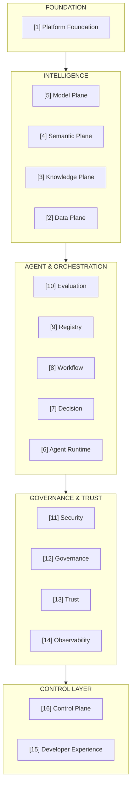
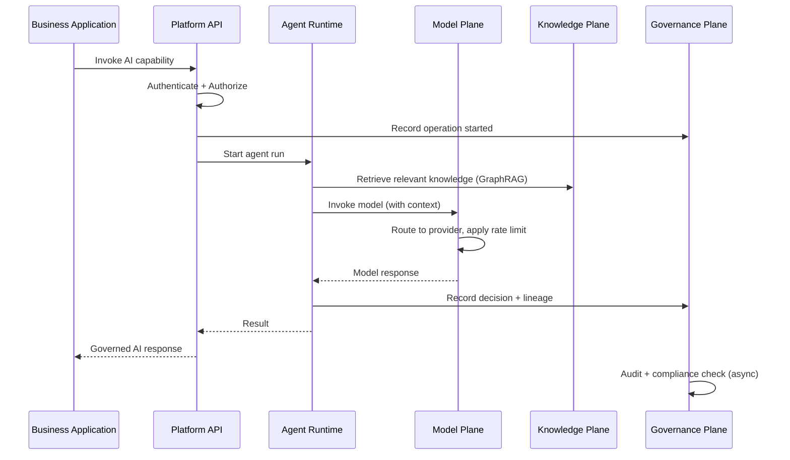

# Platform Architecture Overview

> **Document Type:** Architecture Overview
> **Status:** Blueprint
> **Owner:** Platform Architecture Team
> **Last Updated:** 2026-05-30

---

## What Is the AI Operating Platform?

The AI Operating Platform is an enterprise AI control plane — a horizontal infrastructure layer that enables regulated organizations to deploy, govern, monitor, and evolve AI agents, workflows, and knowledge systems at scale.

It is **not** a chatbot. It is **not** an AI application. It is the **operating system** for AI — the layer between raw AI capabilities (models, embeddings, knowledge) and the business applications that need them.

---

## Platform in Context

```
┌──────────────────────────────────────────────────────────────────┐
│                    BUSINESS APPLICATIONS                          │
│  Loan Origination │ Claims Processing │ Risk Monitoring │ ...    │
│  (Built by tenant teams using Platform SDK/APIs)                 │
├──────────────────────────────────────────────────────────────────┤
│                  AI OPERATING PLATFORM                            │
│    [This is what we are building]                                │
│    Agents │ Knowledge │ Governance │ Observability │ Control      │
├──────────────────────────────────────────────────────────────────┤
│                  AI INFRASTRUCTURE                                │
│  Anthropic Claude │ OpenAI │ Qdrant │ Neo4j │ Ollama │ ...       │
└──────────────────────────────────────────────────────────────────┘
```

---

## The 16-Plane Model

The platform decomposes into 16 functional planes. Each plane has a single, well-defined responsibility.



---

## Key Design Decisions (Summary)

| Decision | Choice | Reason |
|---|---|---|
| Platform language (services) | C# / ASP.NET Core | Enterprise maturity, type safety |
| AI runtime language | Python / FastAPI | AI ecosystem dominance |
| Agent framework | LangGraph | Stateful graphs, HITL, checkpointing |
| Tool protocol | MCP (Model Context Protocol) | Open standard, vendor neutral |
| Container orchestration | Kubernetes | Cloud agnostic, multi-tenant |
| Event streaming | Apache Kafka | Durable audit, replay, high throughput |
| Vector store | Qdrant | OSS, performance, filtering |
| Knowledge graph | Neo4j | Cypher, GDS, GraphRAG |
| Secrets | HashiCorp Vault | Dynamic secrets, PKI, multi-tenant |
| Observability | OpenTelemetry | Vendor neutral |
| Authorization | OPA (Rego) | Policy-as-code |
| Frontend | Next.js / React | Modern, type-safe |

All decisions are documented in full in [docs/adrs/](../adrs/).

---

## Data Flow (High Level)



---

## Non-Functional Architecture

### Performance
- Model invocation P95 latency: < 5 seconds
- RAG retrieval P95 latency: < 500ms
- Platform API P95 latency: < 200ms
- Agent step P95 latency: < 10 seconds

### Availability
- Platform API: 99.9% SLA
- Vault: 99.99% SLA (HA cluster required)
- Kafka: 99.9% SLA (3-broker replication)

### Scale
- Concurrent tenants: 50 (Standard tier)
- Model invocations per hour: 100,000
- Agent runs per hour: 5,000
- Knowledge base documents: 100 million

### Security
- All communication TLS 1.3
- All inter-service mTLS
- Zero static credentials (all dynamic via Vault)
- Zero-trust networking

### Compliance
- GDPR, SR 11-7, EU AI Act, HIPAA, SOX

---

## Where to Go Next

| Goal | Document |
|---|---|
| Understand the vision | [Platform Vision](../vision/platform-vision.md) |
| Review architecture principles | [Architecture Principles](../platform-principles/architecture-principles.md) |
| Deep-dive a specific domain | [Plane Documents](../planes/) |
| Understand a technology choice | [ADRs](../adrs/) |
| Implement a pattern | [Skills Documents](../skills/) |
| Plan implementation | [Roadmap](../roadmaps/roadmap-overview.md) |
| Reference architecture | [Reference Architectures](../reference-architectures/) |
