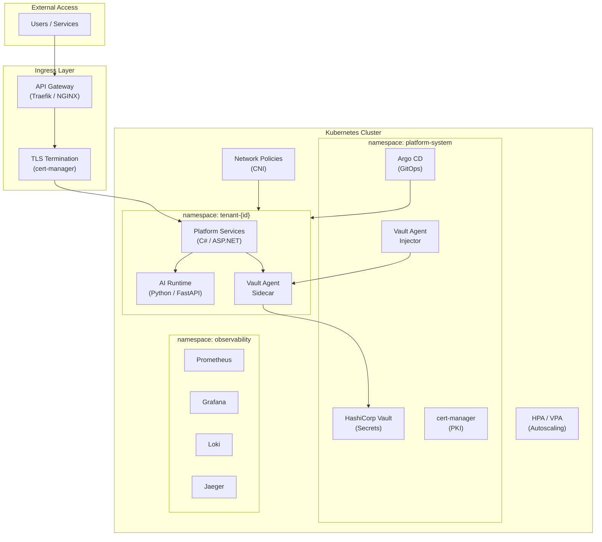
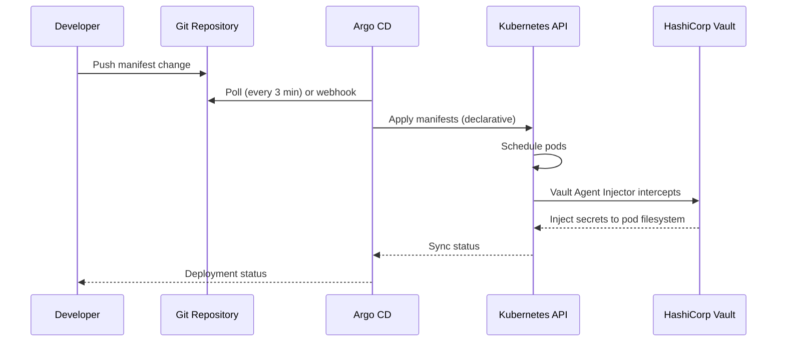
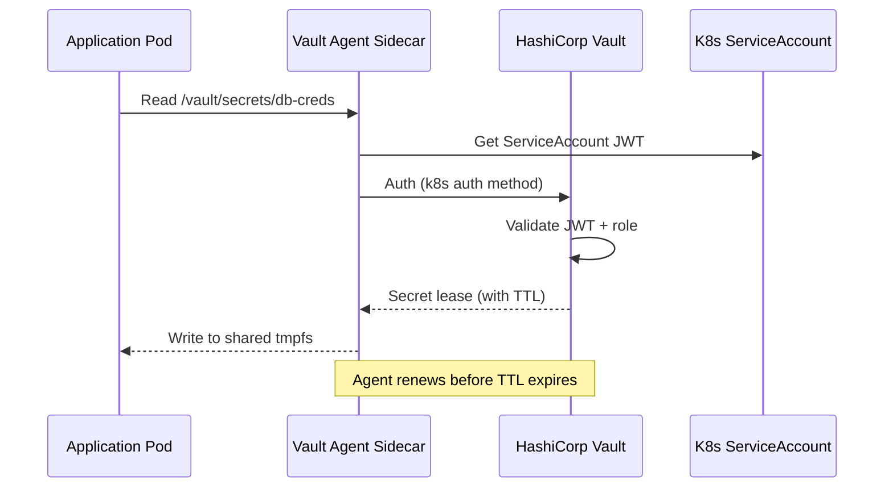
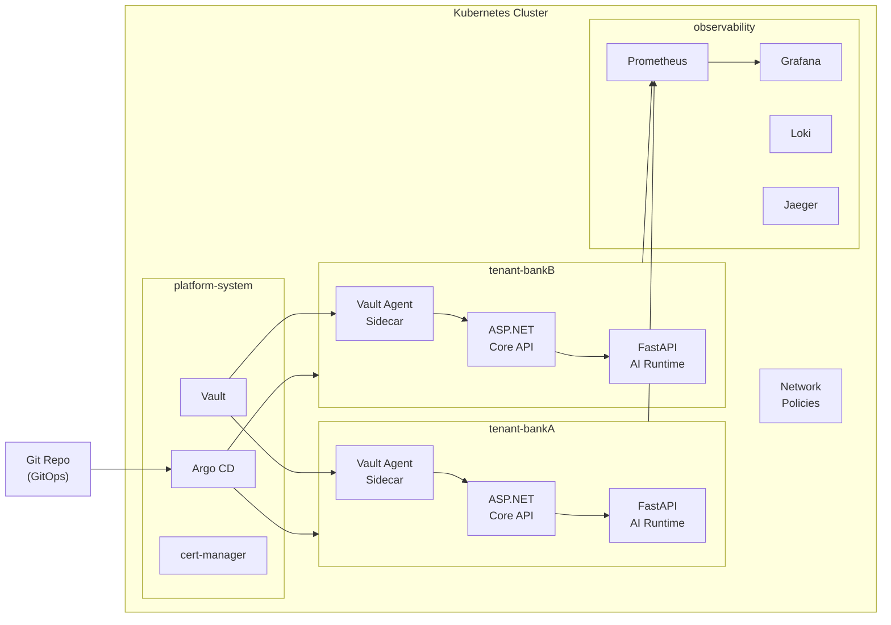

# Plane 01 — Platform Foundation

> **Plane:** 01 — Platform Foundation
> **Status:** Blueprint
> **Owner:** Platform Infrastructure Team
> **Last Updated:** 2026-05-30

---

## 1. Purpose

The Platform Foundation plane is the infrastructure and operational substrate upon which all other planes run. It provides the container runtime, networking, secret management, configuration management, service discovery, health management, and deployment primitives that every other plane depends on.

This plane does not implement AI capabilities. It enables every other plane to exist and function reliably.

---

## 2. Business Problem

Regulated enterprises need AI workloads that are:
- **Reproducible:** The same service behaves identically across dev, staging, and production
- **Isolated:** Tenant workloads cannot interfere with one another
- **Secure by default:** Infrastructure-level security without application code changes
- **Recoverable:** Services restart automatically on failure
- **Auditable:** Infrastructure operations are logged and traceable
- **Portable:** Deployable to any cloud or on-premises without rearchitecting

Without a governed platform foundation, teams deploy services inconsistently, security configurations drift, and operational knowledge is siloed.

---

## 3. Responsibilities

- Container lifecycle management (start, stop, restart, scale)
- Namespace-based multi-tenant isolation in Kubernetes
- Network policy enforcement (who can talk to whom)
- Service discovery and internal DNS
- Secrets injection (Vault Agent Injector sidecar)
- TLS certificate lifecycle management (cert-manager)
- Configuration management (ConfigMaps, Vault KV)
- Health monitoring and self-healing (liveness, readiness probes)
- Horizontal Pod Autoscaling (HPA) and Vertical Pod Autoscaling (VPA)
- Ingress and API gateway management
- Container image registry management
- GitOps deployment (Argo CD)

---

## 4. Non-Responsibilities

- AI model serving (Model Plane responsibility)
- Data storage beyond operational configuration (Data Plane responsibility)
- Business logic of any kind
- Governance policy evaluation (Governance Plane)
- Application-level authentication (Security Plane)
- Agent execution (Agent Runtime)

---

## 5. Architecture Overview



---

## 6. Components

| Component | Technology | Role |
|---|---|---|
| Container Runtime | Docker / containerd | Build and run containers |
| Orchestration | Kubernetes (RKE2 on-prem, EKS/AKS/GKE cloud) | Pod lifecycle, scaling, healing |
| GitOps | Argo CD | Declarative deployment from Git |
| API Gateway | Traefik or NGINX Ingress | External traffic routing, TLS termination |
| Service Mesh | Optional: Istio or Linkerd | mTLS, observability, traffic management |
| Secrets | HashiCorp Vault + Vault Agent Injector | Secret injection without app code changes |
| PKI | cert-manager + Vault PKI engine | Certificate lifecycle |
| Config | Kubernetes ConfigMaps + Vault KV | Externalized configuration |
| Autoscaling | HPA (CPU/memory) + KEDA (event-driven) | Dynamic scaling |
| Network | Calico or Cilium (CNI) | NetworkPolicy enforcement |
| Registry | Harbor (self-hosted) or cloud-native ECR/ACR/GCR | Container image storage |

---

## 7. Internal Services

### 7.1 — Namespace Provisioner
Automates tenant namespace creation with default RBAC, NetworkPolicy, ResourceQuota, and LimitRange applied from templates.

### 7.2 — Secret Injector
Vault Agent Injector sidecar pattern. Services annotate pods; injector writes secrets to a shared tmpfs volume. Application reads secrets from files.

### 7.3 — Certificate Manager
cert-manager issues and renews TLS certificates from Vault PKI or Let's Encrypt (external facing).

### 7.4 — Deployment Controller (GitOps)
Argo CD watches the platform GitOps repository and reconciles cluster state with declared state. All deployments are pull-based.

### 7.5 — KEDA (Kubernetes Event-Driven Autoscaler)
Scales agent runtime pods based on Kafka consumer lag. When AI workloads queue up, KEDA scales up AI runtime pods automatically.

---

## 8. APIs

The Platform Foundation plane does not expose business APIs directly. It provides:

- **Kubernetes API** (internal): Used by other planes for pod management
- **Vault API** (internal): Used by services to retrieve secrets
- **Argo CD API** (internal): Used by CI/CD pipeline to trigger deployments
- **Metrics API** (internal): Kubernetes metrics-server for autoscaling

---

## 9. Data Flow

### Deployment Flow


### Secret Access Flow


---

## 10. Security Requirements

- All inter-namespace traffic blocked by default (NetworkPolicy default-deny)
- Vault Agent Injector for all secret injection (no env var secrets)
- Pod Security Standards: `Restricted` profile for all workloads
- Immutable container filesystem (read-only root where possible)
- No privileged containers
- All images scanned before deployment (Trivy in CI pipeline)
- RBAC: Platform engineers cannot access tenant namespaces
- Tenant engineers cannot access platform-system namespace
- All Vault access logged with requestor identity

---

## 11. Observability Requirements

| Signal | Tooling | What to Capture |
|---|---|---|
| Metrics | Prometheus | Pod CPU/memory, HPA events, API server latency |
| Logs | Loki | Kubernetes system logs, pod stdout/stderr |
| Traces | N/A | Foundation layer is infrastructure; app traces cover service behavior |
| Alerts | Alertmanager | Pod crash loop, OOMKill, HPA max reached, Vault unavailable |

Key Dashboards:
- Cluster resource utilization per tenant namespace
- Vault seal status and secret access rates
- Argo CD sync status (drift detection)
- Certificate expiry calendar

---

## 12. Scalability Considerations

- HPA scales stateless services on CPU/memory (ASP.NET Core, FastAPI)
- KEDA scales event-driven consumers (Kafka consumer lag)
- VPA right-sizes resource requests over time
- Node autoscaling (Cluster Autoscaler) adds nodes when cluster capacity is insufficient
- Resource Quotas prevent any single tenant from consuming all cluster resources

**Limits per tenant (default, configurable):**
```yaml
ResourceQuota:
  requests.cpu: "8"
  requests.memory: "16Gi"
  limits.cpu: "16"
  limits.memory: "32Gi"
  pods: "50"
```

---

## 13. Multi-Tenant Considerations

- **Namespace isolation:** One Kubernetes namespace per tenant
- **Network isolation:** Default-deny NetworkPolicy; explicit allow rules per service
- **Resource isolation:** ResourceQuota per namespace
- **Secret isolation:** Vault namespace per tenant
- **RBAC isolation:** Tenant service accounts cannot read other tenant namespaces
- **Ingress isolation:** Tenant subdomains (`tenant-bankA.platform.internal`)

---

## 14. Future Roadmap

| Priority | Feature | Phase |
|---|---|---|
| High | eBPF-based observability (Cilium Hubble) | Phase 3 |
| High | KEDA advanced scaling triggers (custom metrics) | Phase 2 |
| Medium | WebAssembly (WASM) runtime for lightweight agent sandboxing | Phase 5 |
| Medium | GPU node pool for local model inference | Phase 4 |
| Low | Service mesh (Istio) for mTLS automation | Phase 3 |

---

## 15. Dependencies

| Dependency | Type | Notes |
|---|---|---|
| HashiCorp Vault | Runtime | Must be available before any service starts |
| Kubernetes | Runtime | Core substrate |
| Container Registry | Build time | Images must exist before deployment |
| Git Repository | Deployment | Argo CD source of truth |
| cert-manager | Runtime | Required for TLS |
| Calico / Cilium | Runtime | NetworkPolicy enforcement |

---

## 16. Risks

| Risk | Likelihood | Impact | Mitigation |
|---|---|---|---|
| Vault HA failure | Low | Critical | 3-node Vault cluster, auto-unseal with cloud KMS |
| etcd corruption | Very Low | Critical | Regular etcd backups, Velero for cluster state |
| Namespace quota exhaustion | Medium | High | Alerts at 80% quota usage; quota review process |
| CNI network policy misconfiguration | Medium | High | Policy testing in staging; automated policy verification |

---

## 17. Tradeoffs

| Decision | Gain | Cost |
|---|---|---|
| Namespace-per-tenant | Strong isolation | Namespace management overhead |
| Vault Agent Injector | No secrets in code | Sidecar overhead per pod |
| GitOps (Argo CD) | Audit trail, drift detection | Deployment pipeline dependency |
| Default-deny NetworkPolicy | Security | Manual allowlist management |

---

## 18. Technology Choices

| Category | Primary | Alternative |
|---|---|---|
| Orchestration | Kubernetes (RKE2) | K3s (lightweight edge) |
| GitOps | Argo CD | Flux CD |
| API Gateway | Traefik | NGINX Ingress, Kong |
| Secrets | HashiCorp Vault | OpenBao (BSL concern) |
| PKI | cert-manager | Manual cert management |
| CNI | Calico | Cilium |
| Registry | Harbor | Cloud-native (ECR, ACR) |
| Autoscaling | KEDA + HPA | HPA only |

---

## 19. Alternatives Considered

- **Docker Compose:** Rejected — not suitable for multi-tenant production (ADR-004)
- **Cloud-native container services (ECS, Cloud Run):** Rejected — violates cloud-agnostic principle
- **Nomad:** Rejected — smaller ecosystem (ADR-004)

---

## 20. Sequence Diagrams

See Section 9 (Data Flow) for deployment and secret access sequence diagrams.

---

## 21. Architecture Diagrams


