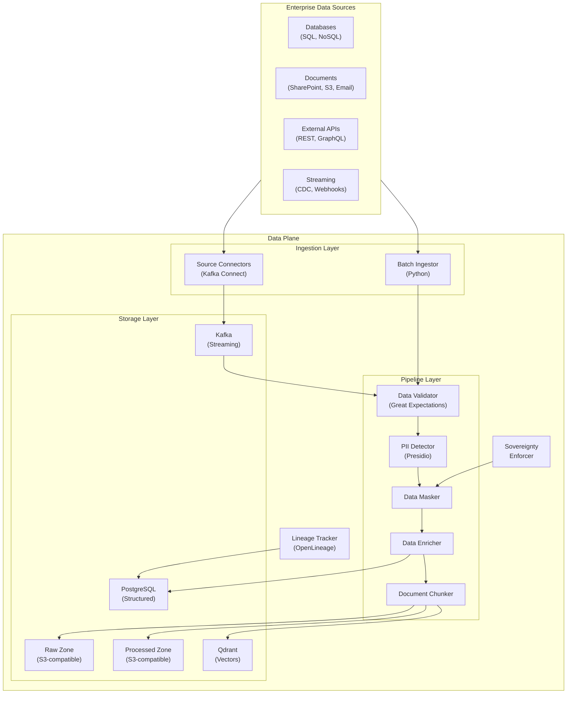
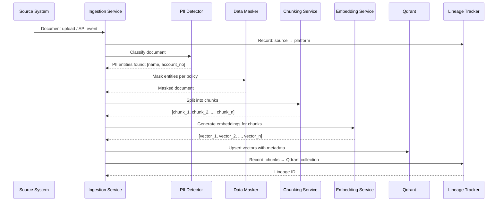

# Plane 02 — Data Plane

> **Plane:** 02 — Data Plane
> **Status:** Blueprint
> **Owner:** Data Engineering Team
> **Last Updated:** 2026-05-30

---

## 1. Purpose

The Data Plane is the ingestion, storage, transformation, and sovereignty layer of the AI Operating Platform. It is responsible for bringing data from enterprise systems into the platform in a governed, sovereign, and AI-ready format. All other planes that need data — the Knowledge Plane, Model Plane, RAG pipelines, and Evaluation Plane — consume data through the Data Plane's controlled interfaces.

---

## 2. Business Problem

AI systems are only as good as the data they access. In regulated enterprises, data access is complex:

- Data lives in dozens of siloed systems (CRMs, core banking, claims systems, document repositories)
- Data sovereignty rules restrict which data can move where (GDPR, HIPAA, data localization laws)
- Data quality is inconsistent; AI ingests bad data and produces bad outputs
- Data lineage is required for regulatory audits ("Where did the AI get this data?")
- PII and sensitive data must be detected and handled before reaching AI models
- Raw data in AI systems creates compliance exposure

The Data Plane solves these problems by acting as the governed entry point for all data flowing into the AI platform.

---

## 3. Responsibilities

- Data source integration (databases, APIs, document stores, streaming sources)
- Data ingestion pipelines (batch and streaming)
- Data quality validation and profiling
- PII detection and classification
- Data masking and anonymization (before AI consumption)
- Data lineage tracking (source → transformation → destination)
- Document chunking and pre-processing for RAG pipelines
- Embedding generation for vector store population
- Data sovereignty enforcement (region tagging, cross-border controls)
- Data retention policy enforcement
- Change data capture (CDC) for real-time knowledge updates
- Storage management (raw, processed, governed zones)

---

## 4. Non-Responsibilities

- Business logic on data (handled by consuming planes)
- AI model invocation (Model Plane)
- Knowledge graph population logic (Knowledge Plane consumes Data Plane outputs)
- Governance policy evaluation (Governance Plane)
- Semantic ontology management (Semantic Plane)

---

## 5. Architecture Overview



---

## 6. Components

| Component | Technology | Role |
|---|---|---|
| Source Connectors | Kafka Connect (JDBC, S3, custom) | Pull data from enterprise systems |
| Batch Ingestor | Python / FastAPI background workers | Scheduled batch ingestion |
| Data Validator | Great Expectations | Schema and quality validation |
| PII Detector | Microsoft Presidio | Detect and classify sensitive entities |
| Data Masker | Custom (Presidio + rules) | Mask/redact PII before AI access |
| Document Chunker | LangChain / custom splitters | Split documents for RAG |
| Embedding Generator | Sentence Transformers / OpenAI Embeddings | Generate vectors for Qdrant |
| Lineage Tracker | OpenLineage | Record data origin and transformations |
| Sovereignty Enforcer | Custom policy engine | Block cross-region data movement |
| Raw Storage | MinIO (S3-compatible) or cloud object storage | Immutable raw data archive |
| Processed Storage | MinIO / S3 | AI-ready data |

---

## 7. Internal Services

### 7.1 — Data Ingestion Service
Manages ingestion jobs: scheduling, retry, error handling, and dead-letter handling for failed records.

### 7.2 — PII Classification Service
Scans incoming documents and structured records for PII. Returns a classification label and identified entities. Results inform masking and sovereignty decisions.

### 7.3 — Chunking Service
Converts documents into semantically meaningful chunks for RAG. Supports:
- Fixed-size chunking
- Recursive character splitting
- Semantic chunking (sentence-boundary aware)
- Table extraction
- Image OCR (for PDF with images)

### 7.4 — Embedding Service
Generates vector embeddings from text chunks. Abstracted over embedding providers:
- Local: `sentence-transformers` (all-MiniLM-L6-v2, BGE-M3)
- Cloud: OpenAI `text-embedding-3-small/large`, Anthropic Voyage, Cohere

### 7.5 — Data Lineage Service
Records every data transformation as an OpenLineage event. Enables "where did this AI output come from?" queries.

### 7.6 — Sovereignty Policy Service
Evaluates data movement requests against tenant data sovereignty rules. Blocks cross-region transfer when policy prohibits it.

---

## 8. APIs

### Data Ingestion API

```
POST   /api/v1/ingestion/jobs              # Create ingestion job
GET    /api/v1/ingestion/jobs/{id}         # Get job status
DELETE /api/v1/ingestion/jobs/{id}         # Cancel job
GET    /api/v1/ingestion/jobs/{id}/lineage # Get lineage for job

POST   /api/v1/documents/upload            # Upload document for processing
GET    /api/v1/documents/{id}/status       # Get processing status
GET    /api/v1/documents/{id}/chunks       # Get document chunks
```

### Data Query API

```
GET    /api/v1/data/search?q={query}&tenant={id}  # Semantic search
POST   /api/v1/data/query                          # Structured query (governed)
GET    /api/v1/data/lineage/{entity_id}            # Lineage for entity
```

### Sovereignty API

```
POST   /api/v1/sovereignty/check           # Check if data movement is allowed
GET    /api/v1/sovereignty/rules/{tenant}  # List sovereignty rules
PUT    /api/v1/sovereignty/rules/{tenant}  # Update sovereignty rules
```

---

## 9. Data Flow

### Document Ingestion Flow



---

## 10. Security Requirements

- All data at rest encrypted (volume-level or application-level)
- All in-transit data uses TLS 1.3
- PII detected and classified before any AI model access
- Masking applied before embedding (AI never sees raw PII unless explicitly authorized)
- Sovereignty rules enforced at ingestion (data tagged with region, classification)
- Data access audited (every read by AI is logged with requester identity)
- Row-level security in PostgreSQL for governed data access
- Qdrant collections access controlled per tenant

---

## 11. Observability Requirements

| Metric | Description |
|---|---|
| `data.ingestion.documents_per_minute` | Throughput of document ingestion |
| `data.ingestion.pii_detections` | Count of PII entities detected (by type) |
| `data.pipeline.error_rate` | Percentage of records failing pipeline |
| `data.embedding.latency_ms` | Embedding generation latency |
| `data.sovereignty.blocked_transfers` | Cross-region transfer blocks |
| `data.lineage.coverage_pct` | Percentage of data with lineage tracking |

Alerts:
- PII detection rate drops to zero (detector failure)
- Ingestion error rate > 5%
- Embedding latency > 5 seconds
- Sovereignty policy evaluation failure

---

## 12. Scalability Considerations

- Kafka Connect scales horizontally via connector tasks
- Chunking and embedding services scale via KEDA (Kafka consumer lag)
- Qdrant distributed mode for high-volume vector workloads
- PostgreSQL read replicas for data query load
- Document processing is CPU-intensive: dedicated node pools for embedding workers

---

## 13. Multi-Tenant Considerations

- Data tagged with `tenant_id` at ingestion (not modifiable after tagging)
- Qdrant: collection per tenant (strong isolation)
- PostgreSQL: schema per tenant or row-level security (RLS)
- Sovereignty rules per tenant (Bank A may have different rules than Insurer B)
- Ingestion rate limits per tenant (prevent one tenant starving others)
- Cross-tenant data access is a security violation, not a configuration option

---

## 14. Future Roadmap

| Priority | Feature | Phase |
|---|---|---|
| High | Real-time CDC (Change Data Capture) for live knowledge updates | Phase 3 |
| High | Automated data quality scoring with AI evaluation | Phase 4 |
| Medium | Data marketplace (governed data sharing between tenants) | Phase 6 |
| Medium | Federated data access (query source without copying) | Phase 5 |
| Low | Multi-modal data support (images, audio, video) | Phase 7 |

---

## 15. Dependencies

| Dependency | Plane/Service | Notes |
|---|---|---|
| Platform Foundation | Infrastructure | Kubernetes, Vault, networking |
| Knowledge Plane | Consumer | Receives processed entity data |
| Model Plane | Consumer | Provides embeddings via Embedding Service |
| Governance Plane | Policy source | Sovereignty and PII rules come from Governance |
| Security Plane | Auth | Data API access controlled by Security Plane |

---

## 16. Risks

| Risk | Likelihood | Impact | Mitigation |
|---|---|---|---|
| PII leaks to AI models | Medium | Critical | Defense-in-depth: detect → mask → audit |
| Data sovereignty violation | Medium | Critical | Automated sovereignty check at every movement |
| Embedding model drift | Medium | High | Pin embedding model versions; rebuild index on change |
| Ingestion pipeline backlog | Medium | High | KEDA auto-scaling; backpressure handling |

---

## 17. Tradeoffs

| Decision | Gain | Cost |
|---|---|---|
| Mask before embedding | Privacy protection | Reduced retrieval accuracy for masked entities |
| Collection-per-tenant in Qdrant | Strong isolation | More collections to manage |
| OpenLineage for lineage | Standard format | Additional tracking overhead |

---

## 18. Technology Choices

| Category | Primary | Alternative |
|---|---|---|
| Document chunking | LangChain text splitters | LlamaIndex node parsers |
| PII detection | Microsoft Presidio | Amazon Comprehend, custom NER |
| Embedding (local) | Sentence Transformers | Ollama embedding models |
| Data validation | Great Expectations | dbt tests |
| Lineage | OpenLineage / Marquez | Apache Atlas |
| Object storage | MinIO (S3-compatible) | Cloud S3, Azure Blob |

---

## 19. Alternatives Considered

- **dbt for transformation:** Good for BI; not optimized for AI data pipelines
- **Apache Spark for processing:** Powerful but operationally heavy; Kafka+Python sufficient at initial scale
- **Commercial data catalog (Collibra, Alation):** Violates OSS-first principle

---

## 20. Sequence Diagrams

See Section 9 (Data Flow).

---

## 21. Architecture Diagrams

See Section 5 (Architecture Overview).
