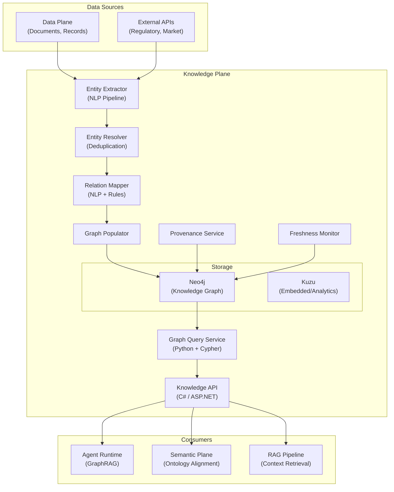
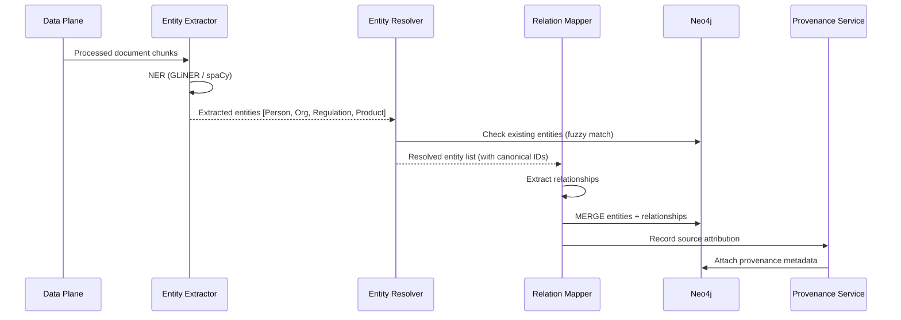

# Plane 03 — Knowledge Plane

> **Plane:** 03 — Knowledge Plane
> **Status:** Blueprint
> **Owner:** Knowledge Engineering Team
> **Last Updated:** 2026-05-30

---

## 1. Purpose

The Knowledge Plane stores, manages, and serves organizational knowledge as a structured, queryable, AI-consumable graph. It transforms enterprise data from raw documents and records into interconnected entities, relationships, and facts that AI agents can reason over. The Knowledge Plane is the platform's long-term institutional memory.

---

## 2. Business Problem

Enterprise AI systems suffer from the "knowledge gap" — models know the world up to their training cutoff but know nothing about the specific organization: its clients, products, policies, regulatory positions, internal processes, and institutional decisions.

This organizational knowledge exists but is inaccessible:
- Locked in documents, PDFs, emails, and wikis
- Stored in relational databases without semantic structure
- Known by employees who may leave the organization
- Siloed across business units without cross-referencing

The Knowledge Plane solves this by extracting, structuring, and serving this knowledge to AI agents in a way that enables accurate, context-aware reasoning.

---

## 3. Responsibilities

- Knowledge graph storage and management (Neo4j)
- Entity extraction from documents and structured data
- Entity resolution (deduplication across sources)
- Relationship mapping between entities
- Knowledge graph queries for AI context retrieval (GraphRAG)
- Knowledge freshness management (updates, versions, deprecations)
- Knowledge provenance (where did this fact come from?)
- Cross-domain knowledge linking (customer ↔ product ↔ policy ↔ regulation)
- Ontology application (entities typed according to Semantic Plane ontologies)
- Knowledge export for RAG pipeline consumption

---

## 4. Non-Responsibilities

- Raw document storage (Data Plane)
- Vector embedding storage (Data Plane manages Qdrant)
- Ontology definition (Semantic Plane defines; Knowledge Plane applies)
- Governance policy evaluation (Governance Plane)

---

## 5. Architecture Overview



---

## 6. Components

| Component | Technology | Role |
|---|---|---|
| Entity Extractor | Python + spaCy + GLiNER | Named entity recognition from text |
| Entity Resolver | Custom + Levenshtein + ML | Deduplicate entities across sources |
| Relation Mapper | Python + NLP + rule engine | Extract relationships between entities |
| Graph Populator | Python + Neo4j driver | Write entities and relationships to graph |
| Knowledge API | C# / ASP.NET Core | Query and management API |
| Graph Query Service | Python + Neo4j driver | Execute Cypher queries for AI context |
| Neo4j | Neo4j 5.x | Primary knowledge graph |
| Kuzu | Kuzu | Embedded graph for analytics |
| Freshness Monitor | Python | Track entity staleness |
| Provenance Service | Python + PostgreSQL | Track entity source attribution |

---

## 7. GraphRAG Query Pattern

```cypher
// Find all regulatory requirements applicable to a specific product in a specific jurisdiction
MATCH (product:Product {id: "DERIVATIVES-EU-001"})
-[:SUBJECT_TO]->(regulation:Regulation)
-[:APPLIES_IN]->(jurisdiction:Jurisdiction {code: "EU"})
-[:HAS_REQUIREMENT]->(requirement:Requirement)
WHERE requirement.effective_date <= date()
RETURN product, regulation, requirement
ORDER BY requirement.priority DESC
LIMIT 20
```

---

## 8. APIs

```
GET  /api/v1/knowledge/entities/{id}               # Get entity
GET  /api/v1/knowledge/entities/search?q=...       # Search entities
POST /api/v1/knowledge/query                        # Execute graph query
GET  /api/v1/knowledge/graph/neighbors/{entity_id} # Get entity neighbors (depth N)
GET  /api/v1/knowledge/provenance/{entity_id}      # Entity source attribution
GET  /api/v1/knowledge/freshness/{entity_id}       # Entity freshness status
POST /api/v1/knowledge/ingest                      # Trigger knowledge ingestion
```

---

## 9. Data Flow

### Knowledge Extraction Flow



---

## 10. Security Requirements

- Knowledge graph access is tenant-scoped (tenant_id label on all nodes)
- Graph queries validated against allowed entity types per agent capability
- No cross-tenant graph traversal
- Entity provenance immutable once recorded

---

## 11. Observability Requirements

| Metric | Description |
|---|---|
| `knowledge.entities.total` | Total entities in graph (by type, tenant) |
| `knowledge.relationships.total` | Total relationships |
| `knowledge.ingestion.rate` | Entities ingested per minute |
| `knowledge.freshness.stale_pct` | % of entities past freshness threshold |
| `knowledge.query.latency_ms` | GraphRAG query latency |

---

## 12. Scalability Considerations

- Neo4j: Read replicas for high-query workloads
- Graph query result caching in Redis (TTL-based)
- Entity extraction parallelized via Kafka consumer workers

---

## 13. Multi-Tenant Considerations

- All graph nodes labeled with `tenant_id`
- Cypher queries injected with tenant filter (WHERE n.tenant_id = $tenant_id)
- Tenant-specific ontology overlays supported via Semantic Plane

---

## 14. Future Roadmap

| Priority | Feature | Phase |
|---|---|---|
| High | Temporal knowledge graph (fact validity over time) | Phase 4 |
| Medium | Knowledge confidence scoring | Phase 4 |
| Medium | Cross-tenant knowledge federation (with consent) | Phase 6 |
| Low | Knowledge graph visualization portal | Phase 6 |

---

## 15. Dependencies

- Data Plane (document input)
- Semantic Plane (ontology definitions)
- Model Plane (for AI-assisted entity extraction)
- Neo4j

---

## 16. Risks

| Risk | Impact | Mitigation |
|---|---|---|
| Entity resolution errors | High | Human-in-the-loop validation for critical entities |
| Knowledge staleness | Medium | Freshness monitoring + automated re-extraction triggers |
| Graph query performance at scale | Medium | Query optimization; read replicas |

---

## 17. Technology Choices

| Category | Primary | Alternative |
|---|---|---|
| Graph database | Neo4j | Apache AGE (PostgreSQL extension) |
| Entity extraction | GLiNER + spaCy | Azure AI Language, AWS Comprehend |
| Embedded graph | Kuzu | NetworkX (Python, non-persistent) |
