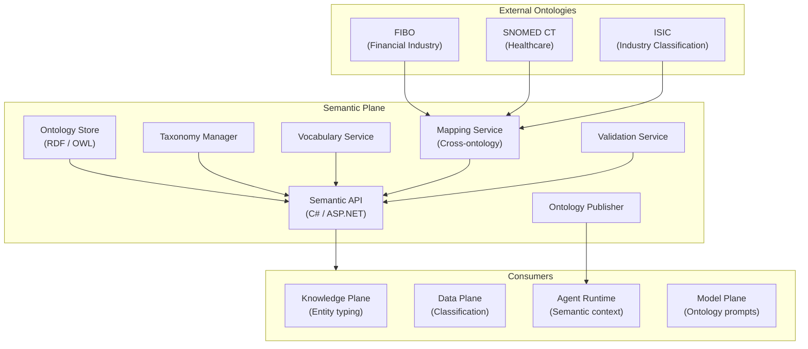

# Plane 04 — Semantic Plane

> **Plane:** 04 — Semantic Plane
> **Status:** Blueprint
> **Owner:** Knowledge Engineering Team
> **Last Updated:** 2026-05-30

---

## 1. Purpose

The Semantic Plane manages the ontologies, taxonomies, controlled vocabularies, and semantic mappings that give meaning and consistency to all data and knowledge within the platform. It ensures that when different parts of the platform (or different tenants) use terms like "customer", "risk", "policy", or "claim", they mean the same thing. The Semantic Plane is the platform's meaning layer — the infrastructure for shared understanding.

---

## 2. Business Problem

Enterprise AI systems fail at precision because terminology is inconsistent:
- "Customer" means policyholder in insurance, borrower in banking, patient in healthcare
- "Risk" means credit risk, operational risk, market risk — depending on context
- AI models trained on general text use general meanings; enterprise AI needs domain-specific meanings

Without a semantic layer:
- AI agents give inconsistent answers across business units
- Knowledge graphs have overlapping, conflicting entity definitions
- RAG retrieval pulls semantically similar but domain-incorrect results
- Regulatory reporting uses inconsistent terminology across systems

---

## 3. Responsibilities

- Ontology definition, versioning, and lifecycle management
- Taxonomy management (hierarchical classification systems)
- Controlled vocabulary management (approved terms and their definitions)
- Semantic mapping between different terminology systems (FIBO ↔ internal terms)
- Ontology validation against incoming data and knowledge
- Domain-specific semantic enrichment of knowledge graph entities
- Semantic search enhancement (expand queries with ontology-aware synonyms)
- Ontology publishing (for AI model context injection)

---

## 4. Non-Responsibilities

- Knowledge graph storage (Knowledge Plane)
- Data ingestion (Data Plane)
- AI model serving (Model Plane)

---

## 5. Architecture Overview



---

## 6. Components

| Component | Technology | Role |
|---|---|---|
| Ontology Store | Apache Jena (RDF/OWL) + PostgreSQL | Store and query ontologies |
| Taxonomy Manager | Custom (C# API) | Hierarchical term management |
| Vocabulary Service | PostgreSQL | Controlled vocabulary CRUD |
| Mapping Service | Custom | Map between ontology systems |
| Validation Service | SHACL (RDF shapes) | Validate data against ontology |
| Ontology Publisher | Custom | Publish ontology as AI prompt context |
| Semantic API | C# / ASP.NET Core | Unified semantic query interface |

---

## 7. Key Ontologies

**Core Platform Ontology:**
- Agent, Tool, Model, Policy, Tenant (platform concepts)

**Domain Ontologies (by tenant industry):**
- **Banking:** FIBO (Financial Industry Business Ontology) — Loan, Counterparty, Collateral, RiskExposure
- **Insurance:** ACORD ontology — Policy, Claim, Insured, Coverage, Peril
- **Healthcare:** SNOMED CT, HL7 FHIR — Patient, Condition, Procedure, Observation
- **Government:** SKOS — Program, Benefit, Agency, Regulation

---

## 8. APIs

```
GET  /api/v1/ontology/classes              # List ontology classes
GET  /api/v1/ontology/classes/{id}         # Get class with properties
GET  /api/v1/ontology/properties/{id}      # Get property definition
POST /api/v1/ontology/validate             # Validate entity against ontology
GET  /api/v1/taxonomy/{id}/descendants     # Get all descendants of a taxonomy node
GET  /api/v1/vocabulary/lookup?term=...    # Look up controlled vocabulary term
GET  /api/v1/mapping?source={}&target={}  # Map term between ontology systems
POST /api/v1/ontology/publish              # Publish ontology snapshot for AI use
```

---

## 9. Multi-Tenant Considerations

- Platform ontology is shared (core platform concepts)
- Domain ontologies are tenant-configurable (bank can extend with internal terms)
- Tenant ontology extends (not overrides) the base domain ontology
- Cross-tenant ontology alignment supported for shared knowledge federation

---

## 10. Technology Choices

| Category | Primary | Alternative |
|---|---|---|
| Ontology representation | OWL 2 (RDF/XML, Turtle) | SKOS (simpler), JSON-LD |
| Ontology store | Apache Jena + TDB2 | Stardog, GraphDB (commercial) |
| Validation | SHACL | ShEx |
| External ontologies | FIBO, SNOMED, ACORD | Industry-specific as needed |

---

## 11. Future Roadmap

| Priority | Feature | Phase |
|---|---|---|
| High | FIBO integration for banking tenants | Phase 3 |
| Medium | SNOMED CT integration for healthcare tenants | Phase 4 |
| Medium | Ontology-guided RAG (expand search with synonyms) | Phase 4 |
| Low | Natural language ontology authoring (AI-assisted) | Phase 6 |
