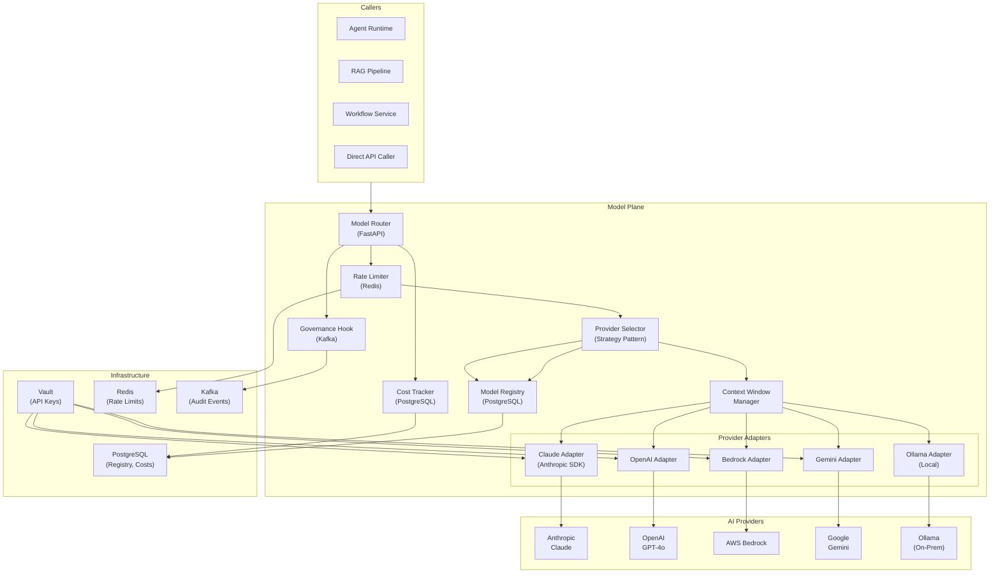
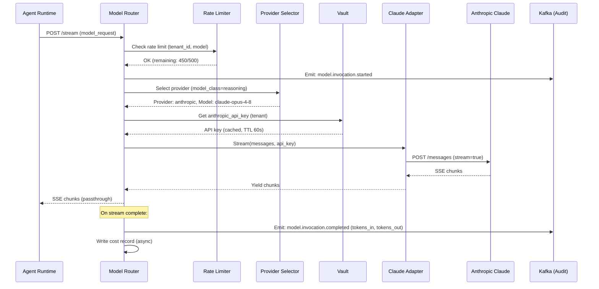

# Plane 05 — Model Plane

> **Plane:** 05 — Model Plane
> **Status:** Blueprint
> **Owner:** AI Engineering Team
> **Last Updated:** 2026-05-30

---

## 1. Purpose

The Model Plane is the provider-agnostic AI model routing, serving, and lifecycle management layer. It is the single abstraction layer through which all AI model invocations flow. No other plane or service invokes an AI model directly — they call the Model Plane, which handles provider selection, credential management, cost tracking, fallback, rate limiting, and governance hooks.

---

## 2. Business Problem

Without a model abstraction layer:
- Each team hardcodes a specific AI provider SDK in their code
- Switching providers requires code changes across the codebase
- API key management is scattered across services
- Cost attribution is impossible (who is spending what on AI?)
- No fallback when a provider has an outage
- No central rate limiting (teams hit provider limits independently)
- No governance audit of what was sent to which model

The Model Plane solves all of these by acting as the enterprise's AI model router.

---

## 3. Responsibilities

- Provider-agnostic model invocation (single interface, multiple backends)
- Model registry (what models are available, their capabilities and costs)
- Provider credential management (via Vault)
- Request routing (which provider handles this request?)
- Fallback chains (if primary provider fails, try secondary)
- Rate limiting (per tenant, per model, per time window)
- Cost tracking (tokens in / tokens out, attributed to tenant and use case)
- Streaming response handling (SSE, WebSocket)
- Model versioning (pin to specific model versions)
- Prompt caching support (Anthropic prompt caching, OpenAI context caching)
- Context window management (handle requests that exceed model limits)
- Governance hook (every model call logged before and after invocation)
- Local model serving (Ollama integration for on-premises models)

---

## 4. Non-Responsibilities

- Business logic in prompts (calling service responsibility)
- Agent orchestration (Agent Runtime)
- Prompt template management (Registry Plane)
- Model training or fine-tuning
- Evaluation of model outputs (Evaluation Plane)
- Embedding generation (separated into Embedding Service in Data Plane)

---

## 5. Architecture Overview



---

## 6. Components

| Component | Technology | Role |
|---|---|---|
| Model Router | Python / FastAPI | Central entry point for all model invocations |
| Model Registry | PostgreSQL | Catalog of models, capabilities, costs, routing rules |
| Provider Selector | Strategy pattern (Python) | Choose provider based on routing rules |
| Rate Limiter | Redis (token bucket / sliding window) | Per-tenant, per-model rate limits |
| Cost Tracker | PostgreSQL (async write) | Token counting and cost attribution |
| Governance Hook | Kafka producer | Emit pre/post invocation events |
| Context Window Manager | Python | Truncate/summarize when context > limit |
| Provider Adapters | Python classes (one per provider) | Provider-specific SDK calls |

---

## 7. Internal Services

### 7.1 — Model Registry Service
CRUD API for model registration. Stores:
- Model ID (platform-internal)
- Provider (anthropic, openai, bedrock, gemini, ollama)
- Provider model ID (`claude-opus-4-8`, `gpt-4o`, etc.)
- Context window limit
- Capabilities (chat, completion, vision, code)
- Cost per 1K input/output tokens
- Status (available, deprecated, maintenance)
- Routing weight (for A/B testing)

### 7.2 — Provider Adapter Registry
Pluggable adapter system. Each adapter implements:
```python
class ModelAdapter(Protocol):
    async def invoke(self, request: ModelRequest) -> ModelResponse: ...
    async def stream(self, request: ModelRequest) -> AsyncIterator[ModelChunk]: ...
    async def health_check(self) -> AdapterHealth: ...
```

### 7.3 — Fallback Chain Manager
Manages ordered fallback sequences per model class:
```
Primary: claude-opus-4-8 → Secondary: claude-sonnet-4-6 → Tertiary: gpt-4o
```
On timeout or 5xx, automatically retries with next in chain.

### 7.4 — Cost Attribution Service
Tracks token usage per: tenant, model, agent_id, use_case. Writes to PostgreSQL. Provides aggregated cost reports via API.

---

## 8. APIs

```
POST /api/v1/models/invoke              # Non-streaming model invocation
POST /api/v1/models/stream              # Streaming model invocation (SSE)
GET  /api/v1/models                    # List registered models
GET  /api/v1/models/{model_id}         # Get model details
POST /api/v1/models/register           # Register new model (admin)

GET  /api/v1/cost/usage                # Token usage report (by tenant/model)
GET  /api/v1/cost/summary/{tenant_id}  # Monthly cost summary

GET  /api/v1/rate-limits/{tenant_id}   # Current rate limit status
PUT  /api/v1/rate-limits/{tenant_id}   # Update rate limits (admin)
```

### Standard Model Request

```json
{
  "model_class": "reasoning",
  "messages": [
    {"role": "system", "content": "You are a risk analyst."},
    {"role": "user", "content": "Assess this counterparty risk profile."}
  ],
  "max_tokens": 2048,
  "temperature": 0.1,
  "tenant_id": "tenant-bankA",
  "agent_id": "risk-agent-001",
  "use_case": "counterparty-risk-assessment",
  "routing_hints": {
    "prefer_provider": "anthropic",
    "require_on_premises": false,
    "data_classification": "confidential"
  }
}
```

---

## 9. Data Flow

### Streaming Model Invocation



---

## 10. Security Requirements

- API keys never logged (hashed reference only in audit)
- API keys from Vault only (never from environment variables)
- All model invocations logged with: tenant, agent, model, timestamp, token counts
- Input prompt hashed (SHA-256) in audit log — not stored in full (privacy)
- Rate limiting enforced before provider calls (prevents cost abuse)
- Model Router's own identity verified (it cannot impersonate tenants)
- Streaming responses do not bypass governance hook

---

## 11. Observability Requirements

| Metric | Description |
|---|---|
| `model.invocations.total` | Total model calls (by provider, model, tenant) |
| `model.invocations.latency_ms` | End-to-end latency per model call |
| `model.tokens.input` | Input tokens consumed |
| `model.tokens.output` | Output tokens generated |
| `model.errors.total` | Error rate (by provider, error type) |
| `model.fallbacks.triggered` | Count of fallback chain activations |
| `model.cost.usd` | Estimated cost in USD (by tenant, model) |
| `model.rate_limit.blocked` | Requests blocked by rate limiter |

---

## 12. Scalability Considerations

- Model Router is stateless; scale horizontally
- Rate limiter uses Redis (centralized, consistent across replicas)
- Cost tracking writes are async (Kafka → consumer → PostgreSQL)
- Streaming connections require persistent HTTP connections; use long-lived pods
- Provider adapter pools with connection reuse (httpx AsyncClient)

---

## 13. Multi-Tenant Considerations

- Rate limits per tenant (different SLAs for different tenants)
- Cost attribution per tenant (billing reports)
- Provider preferences per tenant (Tenant A uses Anthropic; Tenant B uses Bedrock)
- Data sovereignty integration: if data classified as "sovereign", route to on-premises Ollama
- Tenant-specific model allowlists (some tenants may not be allowed to use certain models)

---

## 14. Future Roadmap

| Priority | Feature | Phase |
|---|---|---|
| High | Prompt caching (Anthropic + OpenAI) for cost reduction | Phase 2 |
| High | A/B model routing (shadow model testing) | Phase 4 |
| Medium | Fine-tuned model hosting (private models) | Phase 5 |
| Medium | Model performance budgeting (max latency SLAs per model class) | Phase 3 |
| Low | On-premises GPU inference cluster (vLLM) | Phase 7 |

---

## 15. Dependencies

| Dependency | Notes |
|---|---|
| HashiCorp Vault | API key retrieval |
| Redis | Rate limiting |
| PostgreSQL | Model registry, cost tracking |
| Kafka | Governance audit events |
| Ollama | Local model inference (optional) |
| Evaluation Plane | Receives model output for quality evaluation |

---

## 16. Risks

| Risk | Impact | Mitigation |
|---|---|---|
| Provider API outage | High | Fallback chain; circuit breaker |
| Cost overrun | High | Hard rate limits; cost alerts; budget caps per tenant |
| Prompt injection via model response | High | Output filtering in calling service |
| API key compromise | Critical | Dynamic secrets from Vault; rotate on any exposure signal |

---

## 17. Tradeoffs

| Decision | Gain | Cost |
|---|---|---|
| Abstract all providers | Vendor flexibility | Lowest-common-denominator API |
| Hash prompts in audit | Privacy | Cannot reconstruct exact prompt from audit |
| Async cost tracking | Performance | Slight delay in cost reporting |

---

## 18. Technology Choices

| Category | Primary | Alternative |
|---|---|---|
| Router framework | FastAPI | LiteLLM (consider as alternative) |
| Rate limiting | Redis (token bucket) | nginx rate limiting |
| Cost tracking | PostgreSQL | ClickHouse (for analytics scale) |
| Local models | Ollama | vLLM, LM Studio |
| Streaming | SSE (Server-Sent Events) | WebSocket |

---

## 19. Alternatives Considered

- **LiteLLM as router:** Strong OSS option; considered wrapping LiteLLM instead of custom router. Decision: build custom for full governance integration and enterprise control.
- **OpenAI-compatible gateway (LocalAI):** Good for Ollama; insufficient for multi-provider governance.

---

## 20 & 21. Sequence and Architecture Diagrams

See Sections 5 and 9.
