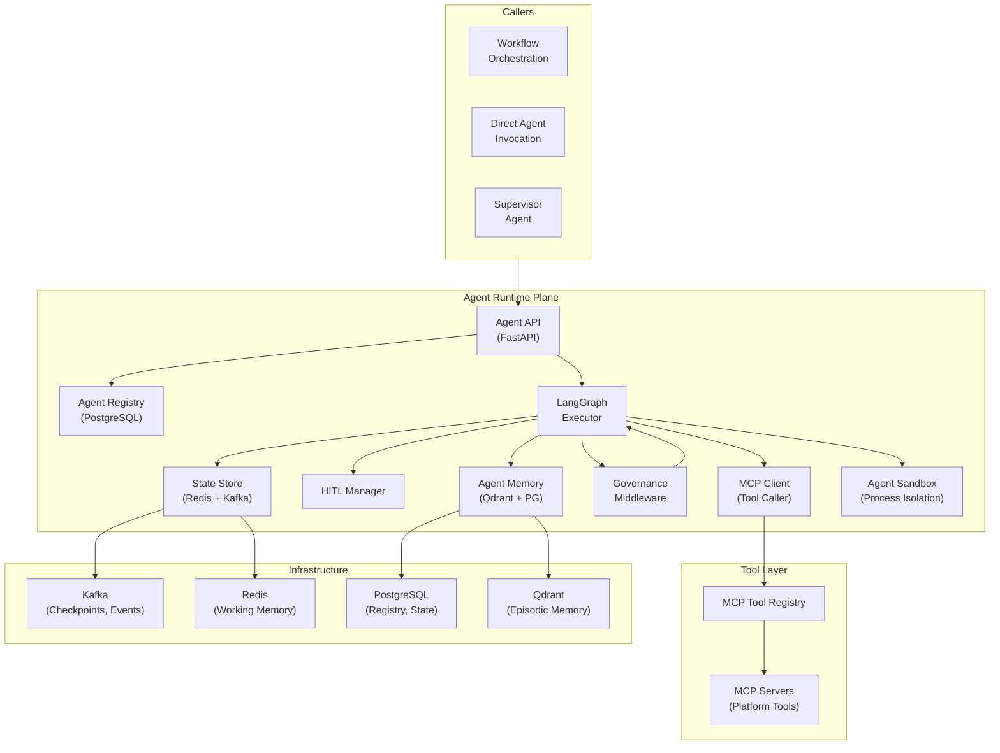
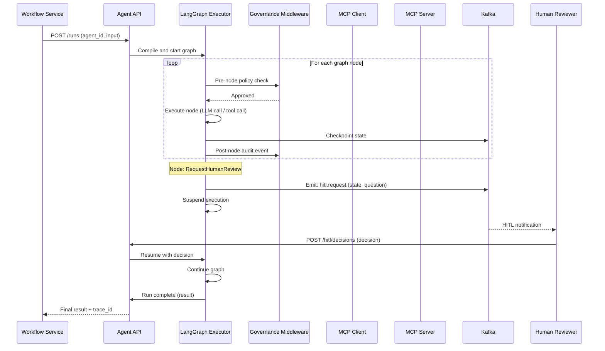

# Plane 06 — Agent Runtime

> **Plane:** 06 — Agent Runtime
> **Status:** Blueprint
> **Owner:** AI Engineering Team
> **Last Updated:** 2026-05-30

---

## 1. Purpose

The Agent Runtime plane is the execution environment for AI agents on the platform. It provides the lifecycle management, execution engine, state management, inter-agent communication, tool integration, and governance enforcement for every AI agent deployed on the platform. Agents are first-class citizens with identities, permissions, resource budgets, and behavioral constraints.

---

## 2. Business Problem

AI agents in enterprise environments must be:
- **Governed:** Agents cannot take actions beyond their declared capabilities
- **Auditable:** Every agent step, decision, and tool call is traceable
- **Reliable:** Agents that crash mid-execution can resume from last checkpoint
- **Safe:** Agents can be paused, interrupted, or overridden by humans
- **Isolated:** One agent's failure does not cascade to others
- **Scalable:** Multiple agent instances can run in parallel

Without a proper agent runtime, teams build custom agent wrappers that are brittle, ungoverned, and impossible to audit or scale.

---

## 3. Responsibilities

- Agent registration and identity management
- Agent lifecycle management (create, start, pause, resume, stop, terminate)
- LangGraph graph compilation and execution
- Agent state persistence and checkpointing (Kafka-backed)
- Human-in-the-loop (HITL) interrupt management
- Tool authorization and MCP client integration
- Multi-agent supervisor/worker coordination
- Agent sandboxing (execution context isolation)
- Per-step governance policy evaluation
- Agent-level resource budget enforcement (token budgets, time limits)
- Real-time streaming of agent progress
- Agent memory management (short-term working memory, long-term episodic memory)
- Dead letter handling for failed agent runs

---

## 4. Non-Responsibilities

- Building the AI models the agents use (Model Plane)
- Governance policy definition (Governance Plane)
- Business workflow orchestration (Workflow Orchestration Plane)
- Evaluation of agent output quality (Evaluation Plane)
- Tool definition and hosting (Registry Plane manages catalog; individual services host tools)

---

## 5. Architecture Overview



---

## 6. Components

| Component | Technology | Role |
|---|---|---|
| Agent API | Python / FastAPI | External interface for agent lifecycle |
| Agent Registry | PostgreSQL | Agent definitions, capabilities, status |
| LangGraph Executor | LangGraph | Graph-based agent execution engine |
| State Store | Redis (working) + Kafka (durable) | Agent state per step |
| HITL Manager | Custom + Kafka | Human review interrupt handling |
| MCP Client | Python MCP SDK | Tool calls to MCP servers |
| Governance Middleware | Custom LangGraph hook | Policy evaluation at each node |
| Agent Memory | Qdrant (semantic) + PostgreSQL (episodic) | Short and long-term agent memory |
| Agent Sandbox | Python subprocess isolation | Agent execution context isolation |

---

## 7. Internal Services

### 7.1 — Agent Registry Service
Manages agent definitions:
```json
{
  "agent_id": "loan-underwriting-agent-v2",
  "agent_type": "reactive",
  "graph_definition": "s3://platform/agents/loan-underwriting-v2.json",
  "capabilities": ["document_analysis", "risk_scoring", "human_review_request"],
  "allowed_tools": ["mcp://platform/knowledge-graph", "mcp://platform/vector-search"],
  "model_preferences": {"primary": "claude-opus-4-8", "fallback": "claude-sonnet-4-6"},
  "resource_budget": {"max_tokens": 100000, "max_runtime_seconds": 300},
  "governance_profile": "high-stakes-financial",
  "tenant_id": "tenant-bankA"
}
```

### 7.2 — LangGraph Executor
Compiles and runs agent graphs. Platform-specific extensions:
- **Kafka checkpointer:** Checkpoints to Kafka after each node
- **OTEL instrumentation:** Span per node execution
- **Governance hook:** Policy evaluation before/after each node
- **Tenant context:** Tenant ID propagated through all tool calls

### 7.3 — HITL Manager
When an agent reaches a human-in-the-loop interrupt node:
1. Agent state saved to Kafka (durable)
2. Human review request emitted to `platform.{tenant}.hitl.requests` Kafka topic
3. Agent execution suspended
4. Human reviewer receives notification (via Workflow Orchestration Plane)
5. Human provides decision (approve/reject/modify)
6. HITL Manager resumes agent from checkpoint with human decision injected

### 7.4 — Multi-Agent Coordinator
Manages supervisor-worker agent patterns:
- Supervisor agent breaks down task into sub-tasks
- Worker agents assigned to sub-tasks (via Agent API)
- Results aggregated by supervisor
- Governance: each worker's governance profile must be compatible with supervisor's

### 7.5 — Agent Memory Service
- **Working memory (Redis):** Current conversation context, tool results, intermediate state
- **Episodic memory (Qdrant):** Past agent interactions, stored as embeddings
- **Semantic memory (Neo4j + Qdrant):** Domain knowledge retrieved during execution

---

## 8. APIs

```
POST /api/v1/agents/register             # Register new agent definition
GET  /api/v1/agents/{agent_id}           # Get agent definition
DELETE /api/v1/agents/{agent_id}         # Deregister agent

POST /api/v1/agents/{agent_id}/runs      # Start agent run
GET  /api/v1/agents/runs/{run_id}        # Get run status and result
POST /api/v1/agents/runs/{run_id}/pause  # Pause running agent
POST /api/v1/agents/runs/{run_id}/resume # Resume paused agent
DELETE /api/v1/agents/runs/{run_id}      # Terminate agent run

GET  /api/v1/agents/runs/{run_id}/trace  # Full execution trace
GET  /api/v1/agents/runs/{run_id}/steps  # Step-by-step breakdown

POST /api/v1/hitl/decisions/{request_id} # Submit HITL decision
GET  /api/v1/hitl/pending                # List pending HITL requests

POST /api/v1/agents/runs/{run_id}/stream # Stream agent progress (SSE)
```

### Agent Run Request

```json
{
  "agent_id": "loan-underwriting-agent-v2",
  "input": {
    "application_id": "APP-2024-001234",
    "documents": ["doc-uuid-1", "doc-uuid-2"],
    "decision_required_by": "2026-05-31T17:00:00Z"
  },
  "context": {
    "tenant_id": "tenant-bankA",
    "initiator": "user-john-smith",
    "business_context": "Loan application underwriting"
  },
  "config": {
    "stream_progress": true,
    "checkpoint_enabled": true
  }
}
```

---

## 9. Data Flow

### Agent Execution with HITL



---

## 10. Security Requirements

- Every agent has a unique platform identity (agent certificate from Vault PKI)
- Agent tool calls authorized by declared tool scope (checked at MCP client layer)
- Agent cannot call tools outside its declared `allowed_tools`
- Agent execution sandboxed (no file system access, no network access beyond MCP)
- Agent resource budgets enforced (token limit, time limit)
- All agent steps logged to Kafka (immutable audit)
- HITL decisions logged with human reviewer identity
- Agent-to-agent communication requires explicit authorization

---

## 11. Observability Requirements

| Metric | Description |
|---|---|
| `agent.runs.active` | Currently running agents |
| `agent.runs.completed` | Completed runs (success/failure) |
| `agent.step.latency_ms` | Per-step execution latency |
| `agent.tool_calls.total` | Tool calls (by tool name) |
| `agent.token_budget.consumed_pct` | Percentage of token budget used |
| `agent.hitl.pending_count` | Pending human review requests |
| `agent.errors.total` | Failed runs (by error type) |
| `agent.checkpoint.lag_ms` | Checkpoint write latency |

---

## 12. Scalability Considerations

- Agent executor pods scaled by KEDA (Kafka consumer lag on agent run queue)
- Each agent run is isolated in its own execution context
- Long-running agents use Kafka checkpoints — executor pod can be replaced mid-run
- Supervisor agents can spawn worker agents dynamically (pool-based scheduling)
- Working memory (Redis) TTL prevents memory leaks from completed runs

---

## 13. Multi-Tenant Considerations

- Agent Registry is tenant-scoped (agents cannot run in other tenants)
- Agent identity includes tenant_id claim (auditable in all logs)
- HITL queue per tenant (reviewers only see their tenant's requests)
- Resource budgets enforced per tenant (one tenant cannot exhaust agent pool)
- Cross-tenant agent invocation requires explicit, auditable grant

---

## 14. Future Roadmap

| Priority | Feature | Phase |
|---|---|---|
| High | Persistent agent memory across sessions | Phase 4 |
| High | Agent capability versioning and rollback | Phase 4 |
| Medium | Agent marketplace (share agent definitions) | Phase 6 |
| Medium | WebAssembly sandboxing for untrusted agent code | Phase 5 |
| Low | Distributed multi-agent consensus (voting patterns) | Phase 7 |

---

## 15. Dependencies

| Dependency | Notes |
|---|---|
| Model Plane | All LLM calls routed through Model Plane |
| Registry Plane | Agent definitions, tool catalog |
| Governance Plane | Policy evaluation at each step |
| MCP Tool Registry | Tool discovery and authorization |
| Kafka | Checkpointing, audit, HITL queue |
| Redis | Working memory, execution state |
| Qdrant | Episodic and semantic memory |
| Vault | Agent credentials, tool credentials |

---

## 16. Risks

| Risk | Impact | Mitigation |
|---|---|---|
| Agent infinite loop | High | Max step count + time budget enforced |
| Agent tool misuse | Critical | MCP authorization at platform layer |
| State checkpoint loss | High | Kafka replication factor >= 3 |
| HITL queue backlog | Medium | Alerting on pending count; escalation timers |

---

## 17. Tradeoffs

| Decision | Gain | Cost |
|---|---|---|
| LangGraph for orchestration | Rich stateful agent patterns | Python-only |
| Kafka checkpointing | Durable, replayable state | Checkpoint overhead per step |
| Governance hook at each node | Fine-grained policy enforcement | Per-node latency overhead |

---

## 18. Technology Choices

| Category | Primary | Alternative |
|---|---|---|
| Agent framework | LangGraph | CrewAI, AutoGen |
| Checkpointing | Kafka | PostgreSQL, Redis |
| Sandboxing | Python subprocess | Docker-in-Docker, WASM |
| Working memory | Redis | In-process dict (no persistence) |
| Episodic memory | Qdrant | Chroma, Redis |
