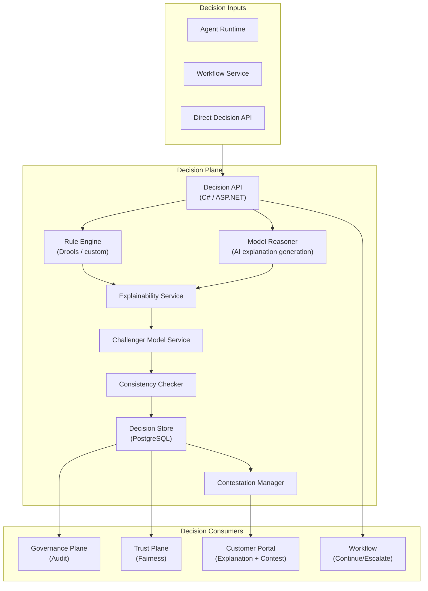

# Plane 07 — Decision Plane

> **Plane:** 07 — Decision Plane
> **Status:** Blueprint
> **Owner:** AI Engineering Team
> **Last Updated:** 2026-05-30

---

## 1. Purpose

The Decision Plane provides structured decision-making infrastructure for AI agents and workflows. It combines rule-based reasoning, AI-model reasoning, and explainability mechanisms to produce decisions that are auditable, contestable, and compliant with regulatory requirements for automated decision-making. Every significant AI-influenced decision passes through or is registered with the Decision Plane.

---

## 2. Business Problem

AI systems in regulated industries must produce decisions that are:
- **Explainable:** "Why did the AI recommend rejection?"
- **Auditable:** "What data and model produced this decision?"
- **Contestable:** "How does the customer challenge this?"
- **Consistent:** "Why did two similar cases get different outcomes?"
- **Rule-compliant:** "Does this decision violate any regulatory rule?"

A pure LLM-based decision system fails all of these. The Decision Plane addresses this by providing a structured decision framework alongside the AI capabilities.

---

## 3. Responsibilities

- Decision record creation and storage
- Rule engine integration (business rules alongside AI reasoning)
- Explainability generation (human-readable decision rationale)
- Decision consistency checking (challenger model comparison)
- Decision override management (human overrides tracked and audited)
- Decision contestation workflow (consumer right to explanation + challenge)
- Decision distribution analysis (fairness monitoring input)
- High-stakes decision gate (mandatory human review trigger)

---

## 4. Non-Responsibilities

- AI model invocation (Model Plane)
- Agent orchestration (Agent Runtime)
- Governance policy evaluation (Governance Plane)
- Bias metrics computation (Trust Plane)

---

## 5. Architecture Overview



---

## 6. Components

| Component | Technology | Role |
|---|---|---|
| Decision API | C# / ASP.NET Core | Entry point for all decisions |
| Rule Engine | Drools (JVM) or custom Python rules | Business rule evaluation |
| Model Reasoner | Python + LangGraph | AI-generated reasoning chain |
| Explainability Service | Python + SHAP / LLM | Human-readable explanation generation |
| Challenger Service | Model Plane | Run decision through challenger model |
| Consistency Checker | Python + statistical tests | Detect inconsistent decisions |
| Decision Store | PostgreSQL | Immutable decision record storage |
| Contestation Manager | C# / ASP.NET | Consumer challenge workflow |

---

## 7. Decision Record Schema

```json
{
  "decision_id": "DEC-2026-001234",
  "decision_type": "loan_approval",
  "tenant_id": "tenant-bankA",
  "subject_id": "APP-2026-001234",
  "timestamp": "2026-05-30T14:23:00Z",
  "outcome": "CONDITIONAL_APPROVAL",
  "confidence": 0.82,
  "reasoning": {
    "primary_factors": ["credit_score: 720", "debt_to_income: 0.38", "employment: 3.5yr"],
    "risk_factors": ["recent_inquiry_count: 3"],
    "rule_outcomes": [{"rule": "DTI_THRESHOLD", "result": "PASS"}],
    "model_reasoning": "Applicant demonstrates stable income with moderate credit utilization..."
  },
  "explanation_human": "Your loan has been conditionally approved...",
  "data_lineage": ["entity:customer-001", "doc:credit-report-001"],
  "model_id": "claude-opus-4-8",
  "challenger_outcome": "CONDITIONAL_APPROVAL",
  "challenger_agreement": true,
  "human_review_required": false,
  "regulatory_flags": [],
  "contestable": true,
  "contest_deadline": "2026-06-30T23:59:59Z"
}
```

---

## 8. APIs

```
POST /api/v1/decisions                          # Create decision record
GET  /api/v1/decisions/{decision_id}            # Retrieve decision
GET  /api/v1/decisions/{decision_id}/explanation # Get human explanation
POST /api/v1/decisions/{decision_id}/contest    # Submit consumer contestation
GET  /api/v1/decisions/consistency-report       # Consistency analysis report
POST /api/v1/decisions/batch-analysis           # Bulk decision analysis (fairness)
```

---

## 9. Multi-Tenant Considerations

- Decision records tenant-scoped; no cross-tenant visibility
- Rules configurable per tenant (tenant-specific business rules alongside platform rules)
- Explanation language configurable per tenant (language, reading level, regulatory context)

---

## 10. Security Requirements

- Decision records immutable (no update or delete)
- Consumer-facing explanations must not expose PII of other individuals
- Contestation submissions authenticated (consumer identity verified)

---

## 11. Technology Choices

| Category | Primary | Alternative |
|---|---|---|
| Rule engine | Drools (JVM) | EasyRules (Java), custom Python |
| Explainability | LLM-generated + SHAP | LIME, DiCE |
| Decision store | PostgreSQL | Cassandra (for very high volume) |
