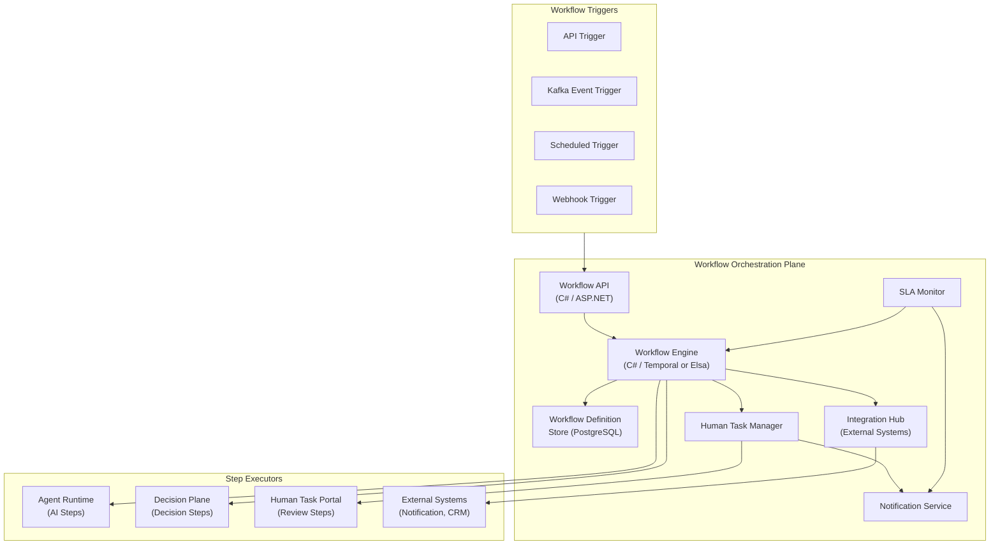

# Plane 08 — Workflow Orchestration

> **Plane:** 08 — Workflow Orchestration
> **Status:** Blueprint
> **Owner:** Platform Engineering Team
> **Last Updated:** 2026-05-30

---

## 1. Purpose

The Workflow Orchestration plane coordinates multi-step, multi-actor business processes that involve AI agents, human reviewers, external systems, and business rules. It is the business process layer above the Agent Runtime — responsible for the orchestration of complete end-to-end processes rather than individual agent graphs. It provides durable, auditable, resumable workflow execution with human-in-the-loop capabilities at the business process level.

---

## 2. Business Problem

Enterprise AI processes are not single-shot — they are multi-step, involve multiple human and AI actors, and may span days or weeks:

- A loan application involves document ingestion, AI underwriting, human review, regulatory check, approval, and notification — each step potentially running at different times
- An insurance claim involves FNOL, damage assessment AI, fraud check, adjuster review, payment authorization, and settlement
- A compliance review involves document analysis, regulatory mapping, risk scoring, legal review, and sign-off

These processes need durability (they survive infrastructure failures), auditability (every step logged), and human coordination (humans can reject, modify, or escalate at any point).

---

## 3. Responsibilities

- Business workflow definition (DAG-based process definitions)
- Workflow instance lifecycle (create, start, pause, resume, complete, cancel)
- Human task management (assignment, notification, deadline tracking)
- Conditional branching based on AI and rule outcomes
- External system integration (webhook triggers, API calls)
- Retry and compensation logic (saga pattern for long-running processes)
- Workflow audit trail (every step with actor, timestamp, outcome)
- Workflow SLA monitoring (alert on approaching deadline)
- Parallel step coordination (fan-out, fan-in)
- Workflow version management

---

## 4. Non-Responsibilities

- AI agent execution internals (Agent Runtime)
- Decision logic within a single AI step (Agent Runtime + Decision Plane)
- Low-level model invocation (Model Plane)
- Infrastructure orchestration (Kubernetes — Platform Foundation)

---

## 5. Architecture Overview



---

## 6. Components

| Component | Technology | Role |
|---|---|---|
| Workflow Engine | Elsa Workflows (C#) or Temporal | Durable workflow execution |
| Workflow Definition Store | PostgreSQL + YAML/JSON definitions | Workflow versioning and storage |
| Human Task Manager | Custom (C# ASP.NET) | Task assignment, tracking |
| Notification Service | Custom + Kafka | Email, Slack, SMS notifications |
| SLA Monitor | Custom + Prometheus alerts | Deadline and SLA tracking |
| Workflow API | C# / ASP.NET Core | External interface |
| Integration Hub | MCP client / REST adapter | Call external systems from workflows |

---

## 7. Workflow Definition Example (YAML)

```yaml
workflow:
  id: loan-underwriting-v3
  version: "3.2"
  name: "Loan Application Underwriting"
  sla_hours: 48
  
  steps:
    - id: document_ingestion
      type: agent_task
      agent_id: document-analysis-agent-v2
      on_success: ai_underwriting
      on_failure: escalate_to_operations
      
    - id: ai_underwriting
      type: agent_task
      agent_id: loan-underwriting-agent-v2
      on_success: risk_gate
      on_failure: escalate_to_underwriter
      
    - id: risk_gate
      type: decision
      condition: "decision.confidence >= 0.85 AND decision.outcome != 'DECLINE'"
      on_true: notify_approval
      on_false: human_underwriter_review
      
    - id: human_underwriter_review
      type: human_task
      assignee_role: senior_underwriter
      deadline_hours: 24
      on_approve: notify_approval
      on_decline: notify_decline
      on_escalate: compliance_review
      
    - id: compliance_review
      type: agent_task
      agent_id: compliance-check-agent-v1
      on_complete: notify_compliance_outcome
```

---

## 8. APIs

```
POST /api/v1/workflows/definitions          # Create workflow definition
GET  /api/v1/workflows/definitions/{id}     # Get definition
POST /api/v1/workflows/instances            # Start workflow instance
GET  /api/v1/workflows/instances/{id}       # Get instance status
POST /api/v1/workflows/instances/{id}/cancel # Cancel workflow
GET  /api/v1/workflows/instances/{id}/history # Step history

GET  /api/v1/tasks/pending                  # Get pending human tasks (for current user)
POST /api/v1/tasks/{id}/complete            # Complete a human task
POST /api/v1/tasks/{id}/escalate            # Escalate a task

GET  /api/v1/workflows/sla/breached         # List SLA-breached instances
```

---

## 9. Multi-Tenant Considerations

- Workflow definitions tenant-scoped
- Human task assignment respects tenant RBAC (only tenant members see tenant tasks)
- SLA rules configurable per tenant
- Notification routing per tenant (tenant's email/Slack config)

---

## 10. Technology Choices

| Category | Primary | Alternative |
|---|---|---|
| Workflow engine | Elsa Workflows (C# OSS) | Temporal (Go server + .NET SDK) |
| Human task UI | Custom React portal | Camunda Tasklist |
| Process definition | YAML + C# activities | BPMN 2.0 (if Camunda used) |

**Note on Temporal:** Temporal is a strong alternative for high-durability requirements. The platform architecture supports either; Elsa is preferred for the C# ecosystem alignment and OSS license.

---

## 11. Future Roadmap

| Priority | Feature | Phase |
|---|---|---|
| High | Visual workflow designer (drag-drop) | Phase 6 |
| Medium | Adaptive workflows (AI suggests next step) | Phase 7 |
| Medium | Cross-tenant workflow federation | Phase 7 |
