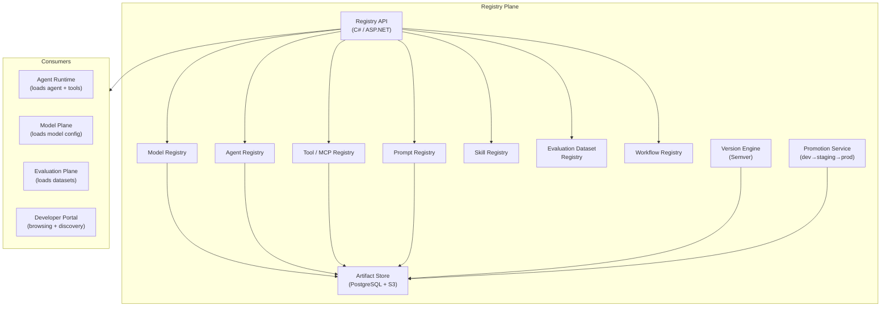

# Plane 09 — Registry Plane

> **Plane:** 09 — Registry Plane
> **Status:** Blueprint
> **Owner:** Platform Engineering Team
> **Last Updated:** 2026-05-30

---

## 1. Purpose

The Registry Plane is the central catalog and artifact store for all reusable platform components: AI models, agents, MCP tools, skills, prompt templates, workflow definitions, and evaluation datasets. It is the platform's app store for AI components — enabling discovery, versioning, sharing, and governed access to all AI building blocks.

---

## 2. Business Problem

Without a central registry:
- Teams duplicate AI components (each builds their own "loan underwriting prompt")
- No version control for prompts (a prompt change breaks production silently)
- Tools are not discoverable (agents use hardcoded integrations)
- Evaluation datasets are scattered and inconsistent
- Model inventory is unknown (which models are deployed? which versions?)

---

## 3. Responsibilities

- **Model Registry:** Catalog of deployed AI models (provider, version, capabilities, cost)
- **Agent Registry:** Catalog of registered agents (definition, version, status)
- **Tool Registry:** MCP tool catalog (discovery, authorization, versioning)
- **Prompt Registry:** Versioned prompt template management
- **Skill Registry:** Reusable AI skill definitions (composite prompts + tools)
- **Evaluation Dataset Registry:** Curated test datasets for model/agent evaluation
- **Workflow Registry:** Versioned workflow definition store
- **Artifact Versioning:** Semantic versioning for all registry artifacts
- **Artifact Promotion:** dev → staging → production promotion workflows
- **Dependency Tracking:** Artifact dependencies and impact analysis

---

## 4. Architecture Overview



---

## 5. APIs

```
# Model Registry
GET  /api/v1/registry/models                     # List models
GET  /api/v1/registry/models/{id}                # Get model details
POST /api/v1/registry/models                     # Register model

# Agent Registry
GET  /api/v1/registry/agents                     # List agents
GET  /api/v1/registry/agents/{id}                # Get agent definition
POST /api/v1/registry/agents                     # Register agent
POST /api/v1/registry/agents/{id}/promote        # Promote agent (dev→staging→prod)

# Tool Registry (MCP)
GET  /api/v1/registry/tools                      # List tools
GET  /api/v1/registry/tools/{id}                 # Get tool definition (MCP schema)
POST /api/v1/registry/tools                      # Register MCP tool

# Prompt Registry
GET  /api/v1/registry/prompts                    # List prompt templates
GET  /api/v1/registry/prompts/{id}/versions      # Get versions
GET  /api/v1/registry/prompts/{id}/versions/{v}  # Get specific version
POST /api/v1/registry/prompts                    # Create prompt template
PUT  /api/v1/registry/prompts/{id}               # Update (creates new version)

# Evaluation Datasets
GET  /api/v1/registry/datasets                   # List evaluation datasets
GET  /api/v1/registry/datasets/{id}              # Get dataset
POST /api/v1/registry/datasets                   # Register dataset
```

---

## 6. Artifact Versioning

All artifacts use semantic versioning (MAJOR.MINOR.PATCH):
- **MAJOR:** Breaking change (e.g., prompt input schema changed)
- **MINOR:** New capability (e.g., new few-shot examples added)
- **PATCH:** Bug fix (e.g., typo correction in prompt)

Agents pin their dependency artifacts:
```json
{
  "agent_id": "loan-underwriting-agent",
  "dependencies": {
    "prompt": "underwriting-system-prompt@2.3.1",
    "tools": ["knowledge-graph-tool@1.0.0", "vector-search-tool@2.1.0"],
    "model": "claude-opus-4-8"
  }
}
```

---

## 7. Multi-Tenant Considerations

- Artifacts can be: `platform` (shared), `tenant-private`, or `tenant-shared` (shared with specific tenants)
- Tenant engineers can browse platform artifacts; they cannot modify them
- Tenant-private artifacts not visible to other tenants
- Promotion workflow requires tenant-admin approval for production

---

## 8. Technology Choices

| Category | Primary | Alternative |
|---|---|---|
| Metadata store | PostgreSQL | Elasticsearch (for full-text search) |
| Artifact storage | MinIO (S3-compatible) | Cloud S3/Azure Blob |
| API | C# / ASP.NET Core | FastAPI (Python) |
| Version control | Custom semver engine | Git tags (for prompts) |
