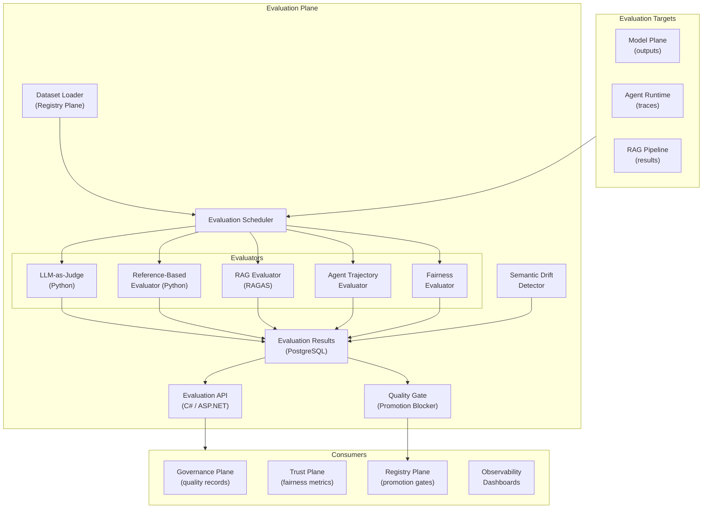

# Plane 10 — Evaluation Plane

> **Plane:** 10 — Evaluation Plane
> **Status:** Blueprint
> **Owner:** AI Quality Team
> **Last Updated:** 2026-05-30

---

## 1. Purpose

The Evaluation Plane continuously measures and reports the quality, alignment, reliability, and safety of every AI model, agent, and output in the platform. It answers: "Are our AI systems doing what we want them to do, at the quality we expect, safely, and consistently?" It enables data-driven decisions about model promotion, agent deployment, and quality degradation alerting.

---

## 2. Business Problem

AI systems degrade silently:
- A model provider updates their model — outputs change without notice
- RAG retrieval quality drops as the knowledge base becomes stale
- A prompt template change causes subtle quality regression
- An agent works well in testing but fails for edge cases in production
- Fairness metrics deteriorate as input data distribution shifts

Without continuous evaluation, these issues are discovered through customer complaints, not instrumentation.

---

## 3. Responsibilities

- Continuous automated evaluation of model and agent outputs
- LLM-as-judge evaluation (using a judge model to score target model outputs)
- Reference-based evaluation (compare against golden datasets)
- RAG-specific evaluation (retrieval quality, faithfulness, relevance)
- Agent trajectory evaluation (was the reasoning path appropriate?)
- Fairness and bias metric tracking
- Semantic drift detection (are outputs changing over time?)
- A/B evaluation (compare primary model against challenger)
- Evaluation dataset management (integration with Registry Plane)
- Quality report generation and alerting
- Promotion gates (artifacts must pass evaluation before production promotion)

---

## 4. Non-Responsibilities

- Model training or fine-tuning
- Governance policy enforcement (Governance Plane)
- Trust and fairness interventions (Trust Plane evaluates and acts; Evaluation Plane measures)

---

## 5. Architecture Overview



---

## 6. Evaluation Metrics

### Model Quality Metrics
| Metric | Method | Target |
|---|---|---|
| Faithfulness | LLM-as-judge | > 0.90 |
| Answer Relevance | LLM-as-judge | > 0.85 |
| Factual Accuracy | Reference-based (golden answers) | > 0.88 |
| Hallucination Rate | LLM-as-judge (detect ungrounded claims) | < 5% |
| Response Consistency | Same question, 5 runs, variance check | Variance < 0.1 |

### RAG-Specific Metrics (RAGAS)
| Metric | Description | Target |
|---|---|---|
| Context Recall | Are the right chunks retrieved? | > 0.85 |
| Context Precision | Are retrieved chunks relevant? | > 0.80 |
| Answer Faithfulness | Is answer grounded in context? | > 0.90 |
| Answer Relevance | Does answer address the question? | > 0.85 |

### Agent Evaluation Metrics
| Metric | Description |
|---|---|
| Task Completion Rate | Did the agent complete its goal? |
| Step Efficiency | Did agent take unnecessary steps? |
| Tool Use Accuracy | Were tool calls appropriate? |
| Human Override Rate | How often do humans override agent decisions? |

---

## 7. LLM-as-Judge Implementation

```python
# Judge prompt structure
JUDGE_PROMPT = """
You are an expert evaluator for AI systems in {domain}.

Question: {question}
Context provided: {context}
AI Response: {response}

Evaluate the response on:
1. Faithfulness (0-1): Is the response grounded in the provided context?
2. Relevance (0-1): Does the response answer the question?
3. Completeness (0-1): Does the response address all aspects of the question?
4. Reasoning quality (0-1): Is the reasoning sound and well-structured?

Return JSON: {{"faithfulness": 0.0, "relevance": 0.0, "completeness": 0.0, "reasoning": 0.0, "explanation": "..."}}
"""
```

---

## 8. APIs

```
POST /api/v1/evaluations/run                # Trigger evaluation run
GET  /api/v1/evaluations/runs/{id}          # Get run results
GET  /api/v1/evaluations/models/{model_id}  # Model quality summary
GET  /api/v1/evaluations/agents/{agent_id}  # Agent quality summary
GET  /api/v1/evaluations/rag/{pipeline_id}  # RAG pipeline quality
GET  /api/v1/evaluations/drift/{entity_id}  # Semantic drift report
GET  /api/v1/evaluations/quality-gate/{id}  # Get promotion gate result
POST /api/v1/evaluations/quality-gate/override # Human override gate (with justification)
```

---

## 9. Quality Gate (Promotion Blocker)

Before any agent or model configuration is promoted to production, the quality gate runs:

1. **Load evaluation dataset** (from Registry Plane)
2. **Run all evaluators** against the artifact
3. **Compare to baseline** (production artifact scores)
4. **Gate decision:**
   - PASS: All metrics above thresholds AND >= baseline
   - WARN: Some metrics below threshold but within tolerance (human review required)
   - FAIL: Critical metric failure (automatic block)

---

## 10. Technology Choices

| Category | Primary | Alternative |
|---|---|---|
| RAG evaluation | RAGAS (Python) | TruLens, DeepEval |
| LLM judge | Claude claude-sonnet-4-6 | GPT-4o |
| Agent eval | Custom (LangGraph traces) | AgentBench |
| Fairness metrics | Fairlearn (Python) | IBM AI Fairness 360 |
| Drift detection | Jensen-Shannon divergence | Population Stability Index |

---

## 11. Future Roadmap

| Priority | Feature | Phase |
|---|---|---|
| High | Continuous production evaluation (shadow evaluation) | Phase 4 |
| High | Automated regression alerting | Phase 4 |
| Medium | Red-teaming automation | Phase 5 |
| Medium | Benchmark comparison (public AI benchmarks) | Phase 5 |
