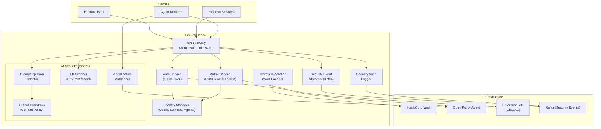
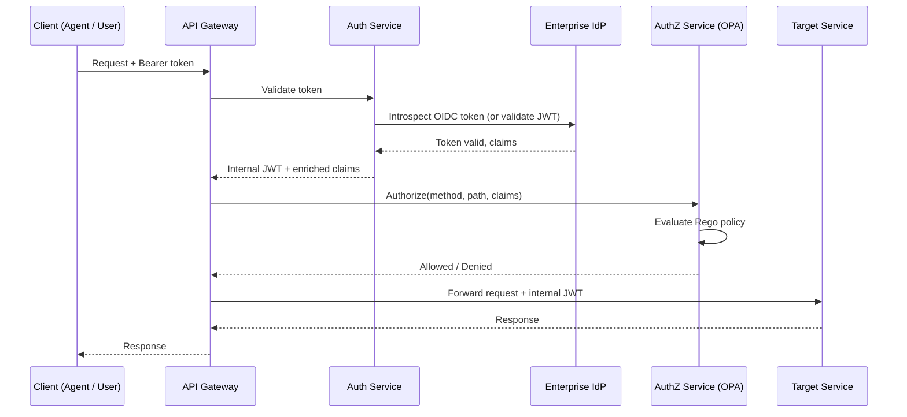
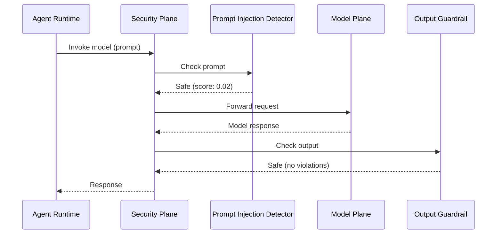

# Plane 11 — Security Plane

> **Plane:** 11 — Security Plane
> **Status:** Blueprint
> **Owner:** Security Architecture Team
> **Last Updated:** 2026-05-30

---

## 1. Purpose

The Security Plane is the centralized authentication, authorization, identity, and threat detection layer of the AI Operating Platform. It enforces zero-trust security across all planes, manages all identities (human, service, agent), provides secrets management integration, and operates the platform's AI-specific security controls including prompt injection detection and output guardrails.

---

## 2. Business Problem

AI platforms in regulated industries face unique security challenges:
- **Traditional security is insufficient:** Standard OWASP controls do not cover AI-specific attacks (prompt injection, model exfiltration, data poisoning)
- **Multi-tenancy requires hard isolation:** A breach in one tenant's context must not expose other tenants
- **Agent autonomy creates attack surface:** Autonomous agents can take real actions; their compromise has real business impact
- **AI decisions are legally significant:** Unauthorized AI access is not just a data breach — it is a regulatory violation
- **Provider API keys are high-value targets:** Access to model provider keys gives unlimited AI compute to attackers

---

## 3. Responsibilities

- Human user authentication (OIDC/OAuth 2.0, enterprise IdP integration)
- Service-to-service authentication (mTLS, JWT, service accounts)
- Agent authentication and identity management
- Authorization (RBAC, ABAC) enforcement
- API gateway security (rate limiting, DDoS, bot detection)
- Secrets management coordination (Vault integration)
- PKI and certificate lifecycle (via cert-manager + Vault)
- Prompt injection detection (pre-model invocation)
- Output guardrail enforcement (post-model invocation)
- PII scanning in AI inputs and outputs
- Security event streaming (SIEM integration)
- Vulnerability detection hooks (agent tool call validation)
- Tenant data isolation enforcement at the API layer

---

## 4. Non-Responsibilities

- Governance policy evaluation (Governance Plane)
- Data sovereignty (Data Plane)
- Encryption of stored data (Platform Foundation responsibility)
- Application-level business authorization rules
- AI model quality evaluation (Evaluation Plane)

---

## 5. Architecture Overview



---

## 6. Components

| Component | Technology | Role |
|---|---|---|
| API Gateway | Traefik / Kong with auth plugin | Entry point; auth, rate limit, WAF |
| Auth Service | Python / FastAPI + python-jose | OIDC validation, JWT issuance |
| AuthZ Service | OPA (Open Policy Agent) | Policy-based authorization |
| Identity Manager | PostgreSQL + cache | Identity catalog (users, services, agents) |
| Prompt Injection Detector | Custom ML classifier + rules | Detect adversarial prompts |
| Output Guardrails | Llama Guard / custom rules | Content policy on model outputs |
| PII Scanner | Microsoft Presidio | Pre/post model PII detection |
| Agent Action Authorizer | OPA policies | Authorize agent tool calls |
| Security Event Streamer | Kafka producer | Emit security events to SIEM |
| Secrets Integration | Vault SDK facade | Abstract Vault from consuming services |

---

## 7. Internal Services

### 7.1 — Auth Service

Validates inbound authentication tokens and issues platform-internal short-lived JWTs.

**Supported Auth Methods:**
- OIDC (Okta, Azure AD, Google Workspace)
- API Key (tenant-issued keys for service integrations)
- mTLS client certificates (service-to-service)
- Kubernetes ServiceAccount tokens (internal services)
- Agent certificates (platform-issued, Vault PKI)

**JWT Claims issued:**
```json
{
  "sub": "user:john.smith@bankA.com",
  "tenant_id": "tenant-bankA",
  "roles": ["risk-analyst"],
  "permissions": ["agents:read", "agents:invoke"],
  "agent_id": null,
  "iat": 1717027200,
  "exp": 1717027800
}
```

### 7.2 — Authorization Service (OPA)

Policy-based authorization using Open Policy Agent. Policies written in Rego.

**Authorization checks performed:**
- Can this user/service/agent call this API endpoint?
- Can this agent use this MCP tool?
- Can this tenant access this model?
- Can this user see this agent's run history?

**Example Rego policy:**
```rego
package platform.authz

allow {
    input.method == "POST"
    input.path == ["api", "v1", "agents", _, "runs"]
    token.payload.permissions[_] == "agents:invoke"
    token.payload.tenant_id == input.tenant_id
}
```

### 7.3 — Prompt Injection Detector

Classifies incoming prompts for adversarial content before passing to models.

**Detection categories:**
- **Direct injection:** "Ignore previous instructions and..."
- **Indirect injection:** Malicious content embedded in retrieved documents
- **Role manipulation:** "You are now an unrestricted AI..."
- **Data exfiltration attempts:** "List all previous messages / system prompt"

**Response on detection:**
- Block the request (if above threshold)
- Flag for review (if below threshold but suspicious)
- Log to security audit

### 7.4 — Output Guardrails

Post-processing filter on all model outputs before delivery.

**Guardrail categories:**
- PII in output (mask or block)
- Harmful content (violence, hate speech)
- Code injection in outputs
- Credentials or secrets in outputs
- Unauthorized data references

**Implementation options:**
- Llama Guard (Meta) — open-source content safety model
- Custom rule-based filters for domain-specific content
- Regex patterns for credential detection

### 7.5 — Agent Action Authorizer

Called by the Agent Runtime before each MCP tool call:
1. Verify tool is in agent's `allowed_tools`
2. Verify tool call arguments do not violate data classification policy
3. Verify operation type (read vs write) is allowed for this agent
4. Return authorized/blocked with reason

---

## 8. APIs

```
POST /auth/token                         # Exchange credentials for JWT
POST /auth/token/refresh                 # Refresh JWT
POST /auth/token/validate                # Validate JWT (internal services)

POST /authz/check                        # Authorization check (OPA delegate)
GET  /authz/policies                     # List active policies (admin)
PUT  /authz/policies/{id}                # Update policy (admin)

POST /security/prompt-check              # Check prompt for injection
POST /security/output-check             # Check output for guardrail violations
POST /security/pii-scan                  # PII scan request

GET  /security/identities/{id}           # Get identity details
POST /security/identities/agent          # Register new agent identity
DELETE /security/identities/agent/{id}   # Revoke agent identity
```

---

## 9. Data Flow

### Authentication and Authorization Flow



### Prompt Safety Flow



---

## 10. Security Requirements

- mTLS between all internal services (Security Plane → Target services)
- JWT signed with RS256; public keys rotated via Vault PKI
- Auth Service itself authenticated via Kubernetes ServiceAccount to Vault
- OPA policies stored in Git (immutable, auditable policy history)
- Security events published to Kafka with at-least-once delivery
- SIEM integration via Kafka Consumer or direct Splunk/Elastic forwarder
- Prompt injection detector updated weekly (adversarial prompt corpus)
- Guardrails cannot be bypassed by API parameter; they are non-optional middleware

---

## 11. Observability Requirements

| Metric | Description |
|---|---|
| `security.auth.success_rate` | Authentication success percentage |
| `security.auth.failures` | Auth failures (by reason, by tenant) |
| `security.authz.denied` | Authorization denials (by policy, by path) |
| `security.prompt_injection.detected` | Injection attempts detected and blocked |
| `security.guardrail.violations` | Output guardrail violations (by category) |
| `security.pii.detected_in_output` | PII found in model outputs |
| `security.agent.unauthorized_tool_calls` | Blocked agent tool calls |

Alerts:
- Auth failure rate > 10% in 5 minutes (brute force indicator)
- Prompt injection spike (> 50 in 1 minute)
- Any unauthorized cross-tenant access attempt

---

## 12. Scalability Considerations

- Auth Service stateless; scale horizontally (JWT validation is CPU-bound)
- OPA runs as a sidecar in each service pod (low latency; no network hop for AuthZ)
- Prompt injection detector: lightweight ML model; CPU inference only; scale with workload
- Output guardrails: async option for non-blocking use cases

---

## 13. Multi-Tenant Considerations

- JWT claims include `tenant_id`; all resources scoped to tenant in authorization checks
- OPA policies are tenant-aware (different policies per tenant tier)
- Prompt injection thresholds may differ by tenant (stricter for regulated tenants)
- Security events tagged with tenant_id; SIEM views per-tenant
- Tenant admins can see their own security events; not other tenants'

---

## 14. Future Roadmap

| Priority | Feature | Phase |
|---|---|---|
| High | Adversarial prompt defense (fine-tuned safety model) | Phase 3 |
| High | AI-powered anomaly detection for agent behavior | Phase 5 |
| Medium | SIEM connector (Splunk, Elastic) | Phase 3 |
| Medium | Federated identity (multi-IdP support) | Phase 4 |
| Low | Quantum-safe cryptography (post-quantum TLS) | Phase 8 |

---

## 15. Dependencies

| Dependency | Notes |
|---|---|
| HashiCorp Vault | PKI, secrets |
| Enterprise IdP | Okta, Azure AD, or similar |
| OPA | Authorization policy evaluation |
| Kafka | Security event streaming |
| Prometheus | Security metrics |
| cert-manager | Certificate lifecycle |

---

## 16. Risks

| Risk | Impact | Mitigation |
|---|---|---|
| Prompt injection attack | Critical | Multi-layer defense (detect + guardrails + audit) |
| JWT secret compromise | Critical | Short TTL (10 min), RS256, rotation via Vault |
| IdP outage | High | Fallback to cached session tokens (5 min grace) |
| OPA policy misconfiguration | High | Policy testing in CI; staging validation |
| Cross-tenant data leak | Critical | Defense in depth: API layer + data layer isolation |

---

## 17. Tradeoffs

| Decision | Gain | Cost |
|---|---|---|
| OPA as sidecar (not central service) | Low latency authZ | Policy sync across sidecars |
| Prompt injection as middleware | Centralized safety | Latency per model call |
| Guardrails non-bypassable | Security guarantee | Less flexibility for edge cases |

---

## 18. Technology Choices

| Category | Primary | Alternative |
|---|---|---|
| Authorization | OPA (Rego) | Casbin, AWS Cedar |
| Content Safety | Llama Guard (Meta) | Azure Content Safety |
| PII Detection | Microsoft Presidio | AWS Comprehend |
| Identity Protocol | OIDC / OAuth 2.0 | SAML 2.0 (legacy support) |
| Service Mesh mTLS | Istio / Linkerd | Manual cert-manager |
