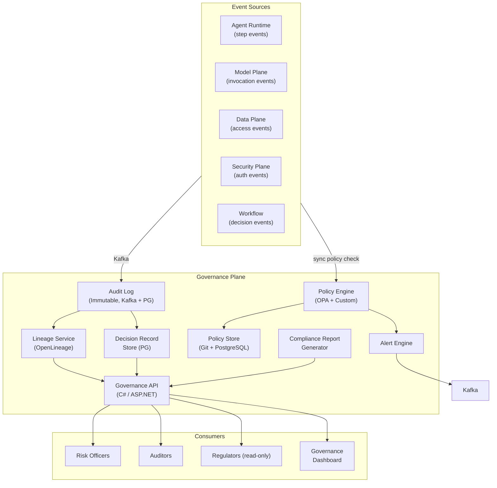
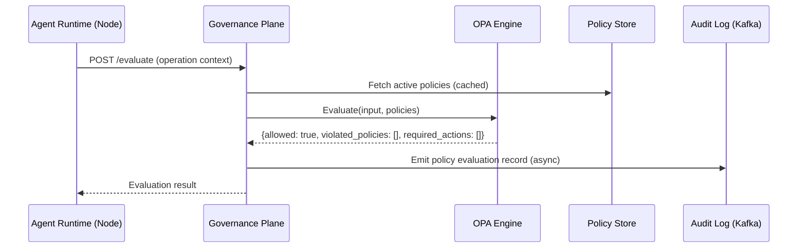
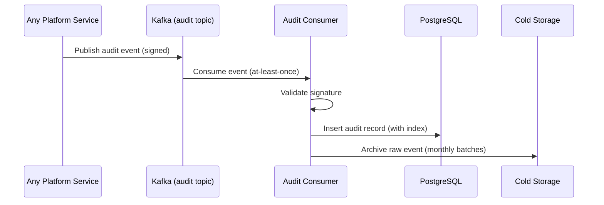

# Plane 12 — Governance Plane

> **Plane:** 12 — Governance Plane
> **Status:** Blueprint
> **Owner:** AI Governance Team
> **Last Updated:** 2026-05-30

---

## 1. Purpose

The Governance Plane is the policy management, compliance enforcement, audit recording, and data lineage system for the AI Operating Platform. It ensures every AI operation is conducted within declared policy boundaries, every AI decision is traceable to its data and model sources, and every compliance obligation is automatically evidenced. It is the platform's regulatory interface — the layer that allows risk officers, auditors, and regulators to answer "What did the AI do? Why? On what data? Who authorized it?"

---

## 2. Business Problem

Regulated enterprises deploying AI face an existential governance challenge:
- **SR 11-7 (Fed):** Model governance frameworks required for all models used in bank decisions
- **GDPR Article 22:** Right to explanation for automated decisions
- **EU AI Act:** High-risk AI systems require audit trails, human oversight, documentation
- **HIPAA:** Audit controls required for AI accessing PHI
- **SOX:** Audit trail for AI-influenced financial reporting

Without a governance plane:
- There is no evidence of policy compliance for regulators
- There is no lineage from AI decision to source data
- Operators cannot answer basic audit questions
- Governance is manual, inconsistent, and costly

The Governance Plane automates regulatory evidence collection and policy enforcement, turning compliance from a quarterly exercise into a continuous automated process.

---

## 3. Responsibilities

- Policy lifecycle management (define, version, activate, retire policies)
- Real-time policy evaluation at operation boundaries
- Immutable audit log (append-only, tamper-evident)
- Data lineage tracking for all AI operations
- Model lineage (which model, version, prompt, produced which output)
- Decision record management (complete context for AI-influenced decisions)
- Compliance report generation (SOX, GDPR, EU AI Act, HIPAA, SR 11-7)
- Alert generation on policy violations
- DPIA (Data Protection Impact Assessment) support documentation
- Governance dashboard (for risk officers and compliance teams)

---

## 4. Non-Responsibilities

- Security enforcement (Security Plane)
- Model quality evaluation (Evaluation Plane)
- Bias and fairness metrics (Trust Plane — though Trust reports flow through Governance)
- Data protection controls (Data Plane enforces; Governance monitors)
- Business workflow decisions (Workflow Orchestration Plane)

---

## 5. Architecture Overview



---

## 6. Components

| Component | Technology | Role |
|---|---|---|
| Policy Engine | OPA (Rego) + Custom rules | Real-time policy evaluation |
| Policy Store | Git (source) + PostgreSQL (runtime) | Policy versioning and runtime access |
| Audit Log | Kafka (stream) + PostgreSQL (queryable) | Immutable operation audit |
| Lineage Service | OpenLineage + Marquez | Data and model lineage tracking |
| Decision Record Store | PostgreSQL | AI decision records (input, output, context, model) |
| Compliance Report Generator | Python | Automated compliance evidence packages |
| Governance API | C# / ASP.NET Core | Query interface for governance data |
| Alert Engine | Custom + Alertmanager | Policy violation alerting |

---

## 7. Internal Services

### 7.1 — Policy Lifecycle Service

Manages the lifecycle of governance policies:
- **Draft:** Policy under review
- **Staged:** Policy in staging validation
- **Active:** Policy enforced in production
- **Retired:** Policy no longer active (history preserved)

Policies versioned in Git. Each policy change creates an immutable history entry.

**Policy Types:**
- **Operational policies:** Rate limits, model restrictions, tool access rules
- **Compliance policies:** Data retention, PII handling, cross-border transfer
- **Ethics policies:** Human oversight requirements, fairness thresholds
- **Regulatory policies:** GDPR, HIPAA, SR 11-7, EU AI Act specific rules

### 7.2 — Audit Log Service

Consumes from `platform.*.*.audit` Kafka topics. Writes to:
- **Kafka** (stream; real-time querying; 7-year retention)
- **PostgreSQL** (structured; queryable; indexed)
- **Cold storage** (S3-compatible; long-term; cost-efficient)

Audit records are signed with a platform-managed key (tamper evidence). Any modification of an audit record is detectable.

**Audit Record Schema:**
```json
{
  "audit_id": "uuid",
  "timestamp": "2026-05-30T14:23:00.000Z",
  "event_type": "agent.step.completed",
  "tenant_id": "tenant-bankA",
  "actor": {
    "type": "agent",
    "id": "loan-underwriting-agent-v2",
    "run_id": "run-uuid"
  },
  "resource": {
    "type": "model_invocation",
    "model_id": "claude-opus-4-8",
    "operation": "chat_completion"
  },
  "input_hash": "sha256:...",
  "output_hash": "sha256:...",
  "tokens_in": 1250,
  "tokens_out": 423,
  "policy_outcome": "approved",
  "lineage_id": "lineage-uuid",
  "signature": "base64:..."
}
```

### 7.3 — Lineage Service

Tracks the complete provenance chain for every AI output:

```
Source Document (Claims Report PDF)
  → Ingested to Data Plane (job: 2026-05-30T10:00Z)
    → Chunked (chunk_45, chunk_46, chunk_47)
      → Embedded (all-MiniLM-L6-v2, v2.1)
        → Retrieved by RAG (query: "policy exclusions")
          → Provided to Agent (claims-agent-v3, run: run-001)
            → Model Invocation (claude-opus-4-8, msg_idx: 3)
              → Decision: "Claim partially covered, see exclusion clause 4.2b"
```

### 7.4 — Decision Record Service

For high-stakes decisions, the complete context is stored:
- Input data (references, not copies — lineage IDs)
- Model used (ID, version)
- Reasoning chain (intermediate steps)
- Output (decision, recommendation, score)
- Human review outcome (if HITL was triggered)
- Applicable policy context
- Challenger model output (if A/B evaluation was run)

### 7.5 — Compliance Report Generator

Generates pre-formatted compliance evidence packages for:
- **GDPR:** Data processing records, DPIA documentation, consent management
- **SR 11-7:** Model governance artifacts (validation, monitoring, inventory)
- **EU AI Act:** High-risk AI system documentation, conformity assessment support
- **SOX:** AI decision audit trail for financial reporting processes
- **HIPAA:** PHI access audit by AI systems

---

## 8. APIs

```
# Policy Management
POST /api/v1/policies                       # Create policy
GET  /api/v1/policies/{id}                  # Get policy
PUT  /api/v1/policies/{id}/activate         # Activate policy
DELETE /api/v1/policies/{id}/retire         # Retire policy
GET  /api/v1/policies/{id}/history          # Policy version history

# Policy Evaluation
POST /api/v1/policies/evaluate              # Evaluate input against policies
GET  /api/v1/policies/evaluate/result/{id}  # Get evaluation result

# Audit
GET  /api/v1/audit/events                   # Query audit events (filtered)
GET  /api/v1/audit/events/{id}              # Get specific audit event
GET  /api/v1/audit/run/{run_id}             # All events for an agent run

# Lineage
GET  /api/v1/lineage/{entity_id}            # Lineage for any entity
GET  /api/v1/lineage/run/{run_id}           # Full lineage for agent run
GET  /api/v1/lineage/decision/{decision_id} # Lineage for a specific decision

# Decision Records
GET  /api/v1/decisions/{decision_id}        # Get decision record
GET  /api/v1/decisions?tenant={id}&from=... # Query decisions (time range)

# Compliance
POST /api/v1/compliance/reports             # Generate compliance report
GET  /api/v1/compliance/reports/{id}        # Get report status
GET  /api/v1/compliance/reports/{id}/download # Download report
```

---

## 9. Data Flow

### Policy Evaluation Flow (Synchronous — for blocking decisions)



### Audit Ingestion Flow (Asynchronous — from all event sources)



---

## 10. Security Requirements

- Audit log is append-only (no UPDATE or DELETE on audit tables)
- Each audit record cryptographically signed (HMAC or asymmetric signature)
- Policy store versioned in Git (immutable history)
- Governance API enforces AuthZ (only authorized roles can query audit)
- Compliance reports generated on-demand; not pre-cached (prevents tampering)
- Policy evaluation results not modifiable by callers
- Audit retention: 7 years minimum (configurable per regulation)

---

## 11. Observability Requirements

| Metric | Description |
|---|---|
| `governance.policy.evaluations_total` | Policy evaluations (by outcome) |
| `governance.policy.violations_total` | Policy violations (by policy_id) |
| `governance.audit.events_ingested` | Audit events written per second |
| `governance.audit.lag_ms` | Delay from event emission to audit write |
| `governance.lineage.coverage_pct` | % of AI outputs with lineage tracked |
| `governance.compliance.report_generation_ms` | Report generation time |

Alerts:
- Audit consumer lag > 30 seconds
- Policy violation rate spike
- Lineage coverage drops below 99%

---

## 12. Scalability Considerations

- Audit consumer horizontally scalable (Kafka consumer group)
- OPA runs as sidecar (no network hop for policy evaluation)
- Audit PostgreSQL: partitioned by date; cold data archived to S3
- Policy store cached in-memory per OPA instance (bundle download pattern)

---

## 13. Multi-Tenant Considerations

- Policies can be global (platform-wide) or tenant-specific
- Audit events tagged with tenant_id; queryable only by that tenant's authorized users
- Compliance reports generated per-tenant
- Cross-tenant audit queries require platform-admin role
- Tenants can define additional compliance policies on top of platform defaults

---

## 14. Future Roadmap

| Priority | Feature | Phase |
|---|---|---|
| High | Automated regulatory mapping (EU AI Act articles) | Phase 5 |
| High | Real-time compliance dashboard | Phase 5 |
| Medium | ML-based anomaly detection in audit patterns | Phase 6 |
| Medium | DPIA automation (Data Protection Impact Assessment) | Phase 5 |
| Low | Regulatory API (read-only access for regulators) | Phase 7 |

---

## 15. Dependencies

| Dependency | Notes |
|---|---|
| Kafka | Audit event streaming; immutable log |
| PostgreSQL | Audit record store, policy store, decision records |
| OPA | Policy evaluation engine |
| OpenLineage / Marquez | Lineage tracking |
| Security Plane | Authentication to Governance API |
| All other planes | Emit audit events to Kafka |

---

## 16. Risks

| Risk | Impact | Mitigation |
|---|---|---|
| Audit gap (events lost) | Critical | Kafka at-least-once; idempotent consumer |
| Policy misconfiguration blocking operations | High | Dry-run mode; staged rollout |
| Lineage gaps | High | Coverage monitoring; alerts on gap |
| Compliance report errors | High | Test reports against known audit data |

---

## 17. Tradeoffs

| Decision | Gain | Cost |
|---|---|---|
| Async audit (Kafka) | Non-blocking operations | Slight delay in audit availability |
| Git-sourced policies | Immutable history, review process | Policy update cycle (not instant) |
| OPA as sidecar | Low latency | Policy sync complexity |

---

## 18. Technology Choices

| Category | Primary | Alternative |
|---|---|---|
| Policy engine | OPA (Rego) | AWS Cedar, Styra DAS |
| Lineage | OpenLineage | Apache Atlas |
| Audit store | PostgreSQL + Kafka | ClickHouse (analytics scale) |
| Policy source | Git (GitOps) | Policy-as-API (more dynamic) |
