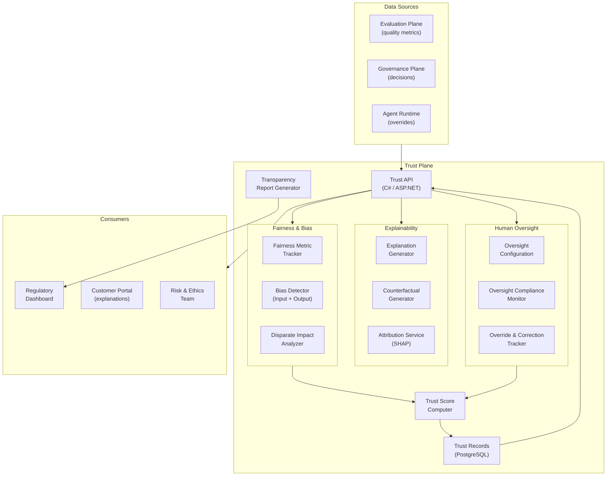

# Plane 13 — Trust Plane

> **Plane:** 13 — Trust Plane
> **Status:** Blueprint
> **Owner:** AI Ethics & Trust Team
> **Last Updated:** 2026-05-30

---

## 1. Purpose

The Trust Plane operationalizes the AI ethics principles into measurable, monitored, and enforceable controls. It tracks bias and fairness metrics, generates explainability artifacts, manages human oversight mechanisms, and provides the infrastructure for building justified confidence in AI system behavior. The Trust Plane answers: "Can we trust this AI system to operate fairly and transparently?"

---

## 2. Business Problem

Trust in AI is not binary — it is earned through evidence:
- Financial regulators require evidence that credit AI does not discriminate
- Healthcare organizations must demonstrate AI does not exhibit racial bias
- Customers have a legal right to meaningful explanations under GDPR
- Regulators need to verify AI systems operate within declared ethical boundaries
- Business leaders need confidence metrics before expanding AI autonomy

Without the Trust Plane, these requirements are addressed through ad-hoc, inconsistent, and often insufficient measures.

---

## 3. Responsibilities

- Fairness metric computation and continuous monitoring (demographic parity, equalized odds)
- Bias detection in AI inputs, retrieval context, and outputs
- Explainability artifact generation (feature attribution, decision rationale)
- Human oversight management (oversight requirements per AI system)
- AI system confidence scoring (calibrated confidence in AI outputs)
- Transparency reporting (what AI systems are deployed, their capabilities, limitations)
- Adversarial robustness testing (stress test AI resilience)
- Trust score computation per AI agent/model (multi-dimensional trust metric)
- Consumer-facing explanation generation
- Override and correction tracking (humans correcting AI decisions)

---

## 4. Architecture Overview



---

## 5. Fairness Metrics

| Metric | Definition | Alert Threshold |
|---|---|---|
| Demographic Parity | P(outcome\|groupA) ≈ P(outcome\|groupB) | Difference > 0.05 |
| Equalized Odds | Equal TPR and FPR across groups | Difference > 0.03 |
| Individual Fairness | Similar individuals → similar outcomes | Cosine sim > 0.9 → outcome diff < 0.1 |
| Counterfactual Fairness | Outcome unchanged when sensitive attr changed | Must hold for all protected attrs |

---

## 6. Trust Score

Composite score (0-1) for each AI agent/model:

```
TrustScore = weighted_average(
  fairness_score        * 0.25,
  calibration_score     * 0.20,
  explanation_quality   * 0.15,
  oversight_compliance  * 0.20,
  robustness_score      * 0.10,
  consistency_score     * 0.10
)
```

Trust score gates:
- **> 0.85:** Full autonomy approved
- **0.70 - 0.85:** Partial autonomy; sample auditing
- **0.55 - 0.70:** Human review required for high-stakes decisions
- **< 0.55:** Deployment blocked; remediation required

---

## 7. APIs

```
GET  /api/v1/trust/scores/{agent_id}            # Current trust score
GET  /api/v1/trust/fairness/{agent_id}          # Fairness metrics breakdown
GET  /api/v1/trust/explanations/{decision_id}   # Get explanation for decision
POST /api/v1/trust/explanations/generate         # Generate explanation on-demand
GET  /api/v1/trust/transparency/report          # Platform transparency report
GET  /api/v1/trust/oversight/{agent_id}         # Oversight compliance status
POST /api/v1/trust/overrides                    # Record human override
GET  /api/v1/trust/overrides/{agent_id}         # Override history + patterns
```

---

## 8. Human Oversight Configuration

Each AI agent has a declared oversight profile:
```json
{
  "agent_id": "loan-underwriting-agent-v2",
  "oversight_profile": "high-stakes-financial",
  "requirements": {
    "random_sample_review_pct": 5,
    "mandatory_review_conditions": ["outcome=DECLINE", "confidence<0.75"],
    "human_override_allowed": true,
    "escalation_on_disagreement": true,
    "quarterly_bias_audit": true
  }
}
```

---

## 9. Transparency Report

Published quarterly. Contains:
- Inventory of all AI systems deployed (by tenant, use case, model)
- Trust scores and trends (improving / degrading)
- Fairness metrics across protected groups
- Override rates (AI decisions corrected by humans)
- Significant incidents (AI failures, near-misses)
- Remediation actions taken

---

## 10. Technology Choices

| Category | Primary | Alternative |
|---|---|---|
| Fairness metrics | Fairlearn (Python) | IBM AIF360 |
| Feature attribution | SHAP | LIME, Integrated Gradients |
| Counterfactuals | DiCE (Python) | Alibi |
| Calibration | sklearn.calibration | Custom Platt scaling |

---

## 11. Future Roadmap

| Priority | Feature | Phase |
|---|---|---|
| High | Real-time fairness monitoring with drift alerts | Phase 5 |
| High | Automated remediation suggestions for bias | Phase 5 |
| Medium | Consumer-facing AI card (plain language disclosure) | Phase 6 |
| Low | Regulatory submission automation (EU AI Act) | Phase 8 |
