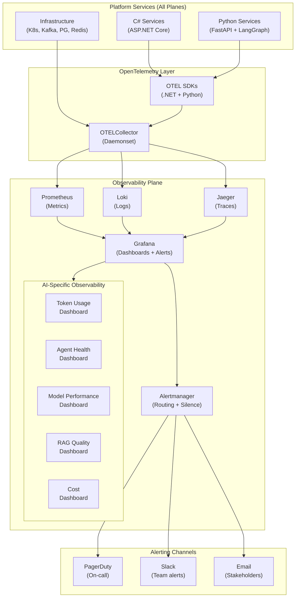
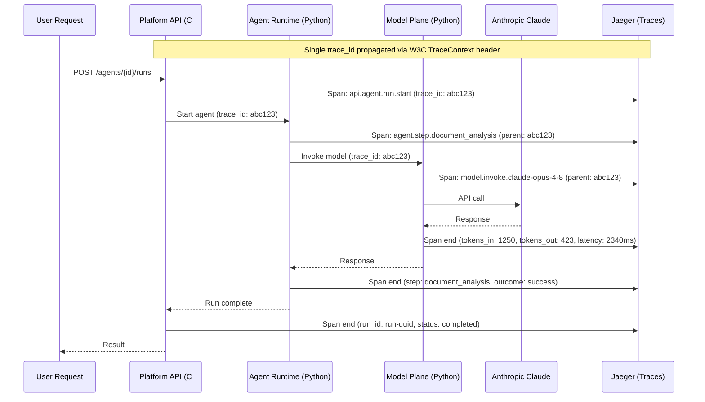

# Plane 14 — Observability Plane

> **Plane:** 14 — Observability Plane
> **Status:** Blueprint
> **Owner:** Platform Engineering Team
> **Last Updated:** 2026-05-30

---

## 1. Purpose

The Observability Plane provides the complete telemetry — traces, metrics, and logs — for every operation in the AI Operating Platform. It enables platform engineers, AI engineers, and operations teams to understand system health, debug failures, measure AI quality, and detect anomalies in real time. Unlike traditional observability, the Observability Plane includes AI-specific signals: token usage, model latency, agent step traces, RAG retrieval quality, and semantic drift indicators.

---

## 2. Business Problem

AI systems fail silently in ways that traditional monitoring misses:
- A model returns a plausible but incorrect answer — no HTTP error, no alert
- An agent loops through reasoning steps spending tokens without progress
- RAG retrieval quality degrades as the knowledge base becomes stale
- Token costs spike because a prompt template changed
- A model provider has elevated latency but is technically available

Without AI-specific observability, these failures are discovered by end users, not by operations teams.

---

## 3. Responsibilities

- OpenTelemetry SDK integration across all platform services
- Distributed tracing across the full AI operation chain (API → Agent → Model → Tool)
- Metrics collection (infrastructure + AI-specific)
- Structured log aggregation
- Alerting and on-call notification
- AI-specific dashboards (model performance, agent health, RAG quality)
- Trace correlation (correlate a user request to every AI step it triggered)
- Cost observability (token usage, cost per tenant, cost anomalies)
- SLO (Service Level Objective) tracking and burn-rate alerting
- Log-based metric derivation (extract metrics from structured logs)

---

## 4. Non-Responsibilities

- Evaluation of AI output quality (Evaluation Plane — though evaluation metrics are surfaced here)
- Governance audit (Governance Plane — audit events are separate from observability)
- Security event analysis (Security Plane — SIEM is separate)
- Business intelligence (this is operational observability, not BI)

---

## 5. Architecture Overview



---

## 6. Components

| Component | Technology | Role |
|---|---|---|
| OTEL Collector | OpenTelemetry Collector | Central telemetry pipeline |
| Metrics Backend | Prometheus | Time-series metrics storage |
| Log Backend | Loki | Log aggregation (label-based) |
| Trace Backend | Jaeger | Distributed trace storage |
| Dashboard & Alert | Grafana | Visualization, alerting, SLO tracking |
| Alert Router | Alertmanager | Alert routing, deduplication, silence |

---

## 7. Internal Services

### 7.1 — OTEL Collector Pipeline

Deployed as a Kubernetes DaemonSet. All platform services export to the local node's collector.

**Pipeline stages:**
1. **Receivers:** OTLP (gRPC/HTTP), Prometheus scrape, Kubernetes log tailing
2. **Processors:** Batch, memory limiter, attribute enrichment (add tenant_id, environment)
3. **Exporters:** Prometheus (metrics), Loki (logs), Jaeger (traces)

### 7.2 — AI-Specific Telemetry

**Custom OTEL attributes added to every AI span:**
```
ai.model.provider          = "anthropic"
ai.model.id                = "claude-opus-4-8"
ai.model.tokens_in         = 1250
ai.model.tokens_out        = 423
ai.model.latency_ms        = 2340
ai.model.finish_reason     = "stop"
ai.agent.id                = "loan-underwriting-agent-v2"
ai.agent.run_id            = "run-uuid"
ai.agent.step_number       = 3
ai.agent.step_name         = "document_analysis"
ai.rag.retrieval_count     = 5
ai.rag.top_score           = 0.91
ai.tenant.id               = "tenant-bankA"
ai.use_case                = "loan-underwriting"
```

### 7.3 — SLO Definitions

Platform SLOs tracked via Grafana SLO plugin:

| SLO | Target | Burn Rate Alert |
|---|---|---|
| Agent run success rate | 99.5% | 5x in 1 hour |
| Model invocation latency P95 | < 5 seconds | 2x in 30 min |
| RAG retrieval latency P95 | < 500ms | 3x in 1 hour |
| Platform API availability | 99.9% | 2x in 15 min |
| Governance audit lag | < 30 seconds | Any breach |

### 7.4 — Grafana Dashboard Catalog

**Infrastructure Dashboards:**
- Cluster Overview (CPU, memory, network per namespace)
- Kafka Consumer Lag (per consumer group, per topic)
- PostgreSQL Query Performance
- Redis Cache Hit Rate
- Vault Secret Access Rates

**AI Operational Dashboards:**
- Model Performance (latency, error rate, token throughput per provider)
- Agent Health (active runs, step latency, failure rate, HITL queue depth)
- RAG Quality (retrieval count, top scores, latency distribution)
- Token Usage and Cost (per tenant, per model, per time period)
- Knowledge Freshness (time since last knowledge update per tenant)

**Business Dashboards:**
- Tenant Activity Overview (API calls, agent runs, decisions)
- SLO Status (current error budget, burn rate)
- Platform Capacity (headroom before quota exhaustion)

---

## 8. APIs

The Observability Plane does not expose external APIs. It is consumed via:
- Grafana UI (dashboards, alerts)
- Prometheus query API (internal metric queries by other services)
- Jaeger UI (trace exploration)
- Loki query API (log querying)
- Alertmanager API (alert management)

Programmatic access to observability data:
```
GET  /api/datasources/proxy/{prometheus_uid}/api/v1/query?query=...
GET  /api/datasources/proxy/{loki_uid}/loki/api/v1/query_range?...
```

---

## 9. Data Flow

### Trace Flow (Distributed AI Operation)



---

## 10. Security Requirements

- Grafana authentication via OIDC (same enterprise IdP as platform)
- RBAC in Grafana: Tenant engineers see only their tenant's dashboards
- Platform admins see all dashboards
- Metrics data in Prometheus does not contain PII (attribute scrubbing in OTEL pipeline)
- Log data runs through PII redaction before Loki ingestion
- Jaeger traces: prompt content not included (hashed reference only)
- Alertmanager webhook URLs stored in Vault (not in ConfigMap)

---

## 11. Scalability Considerations

- Prometheus: sharded by plane or tenant namespace at scale
- Thanos (Prometheus long-term storage) for multi-week metrics retention
- Loki: horizontally scalable (boltdb-shipper + S3 backend)
- Jaeger: Elasticsearch or Cassandra backend for high-trace-volume deployments
- OTEL Collector: DaemonSet ensures no single collector is a bottleneck

---

## 12. Multi-Tenant Considerations

- Every metric, log, and trace labeled with `tenant_id`
- Grafana folders per tenant with RBAC (tenants only see their folder)
- Prometheus metric labels allow per-tenant filtering without data isolation
- Loki log streams labeled with `tenant_id` (Loki's multi-tenancy via X-Scope-OrgID)
- Jaeger traces tagged with `tenant_id`; Grafana datasource per-tenant configured with fixed tags

---

## 13. Future Roadmap

| Priority | Feature | Phase |
|---|---|---|
| High | AI quality metrics from Evaluation Plane in Grafana | Phase 4 |
| High | Cost anomaly detection (token budget alerts) | Phase 3 |
| Medium | Continuous SLO tracking with Grafana SLO plugin | Phase 3 |
| Medium | eBPF-based observability (Cilium Hubble) for deep networking | Phase 5 |
| Low | AI-powered alert noise reduction (ML clustering of alerts) | Phase 7 |

---

## 14. Dependencies

| Dependency | Notes |
|---|---|
| OpenTelemetry SDK | Required in every service (.NET + Python) |
| Kubernetes | OTEL Collector DaemonSet |
| Prometheus | Metrics storage |
| Loki | Log storage (MinIO or S3 backend) |
| Jaeger | Trace storage |
| Grafana | Dashboard and alerting |
| All platform planes | Must instrument with OTEL |

---

## 15. Risks

| Risk | Impact | Mitigation |
|---|---|---|
| Observability data contains PII | High | OTEL pipeline PII scrubber |
| Prometheus cardinality explosion | High | Label cardinality limits; recording rules |
| Alert fatigue | Medium | Burn-rate alerting; alert grouping |
| Observability infrastructure unavailability | Medium | Separate namespace with own resource quotas |

---

## 16. Tradeoffs

| Decision | Gain | Cost |
|---|---|---|
| OTEL collector pipeline | Vendor-neutral telemetry | Collector operational overhead |
| Loki (label-based) vs Elasticsearch | Lower cost, simpler ops | Less powerful full-text search |
| Hash prompts in traces | Privacy | Cannot reconstruct from trace |

---

## 17. Technology Choices

| Category | Primary | Alternative |
|---|---|---|
| Metrics | Prometheus + Thanos | VictoriaMetrics, Datadog |
| Logs | Loki | Elasticsearch + Kibana, Datadog |
| Traces | Jaeger | Tempo, Zipkin, Datadog APM |
| Dashboards | Grafana | Kibana, Datadog |
| Telemetry pipeline | OTEL Collector | Fluentd, Vector |
| Alert routing | Alertmanager | PagerDuty rules, OpsGenie |
