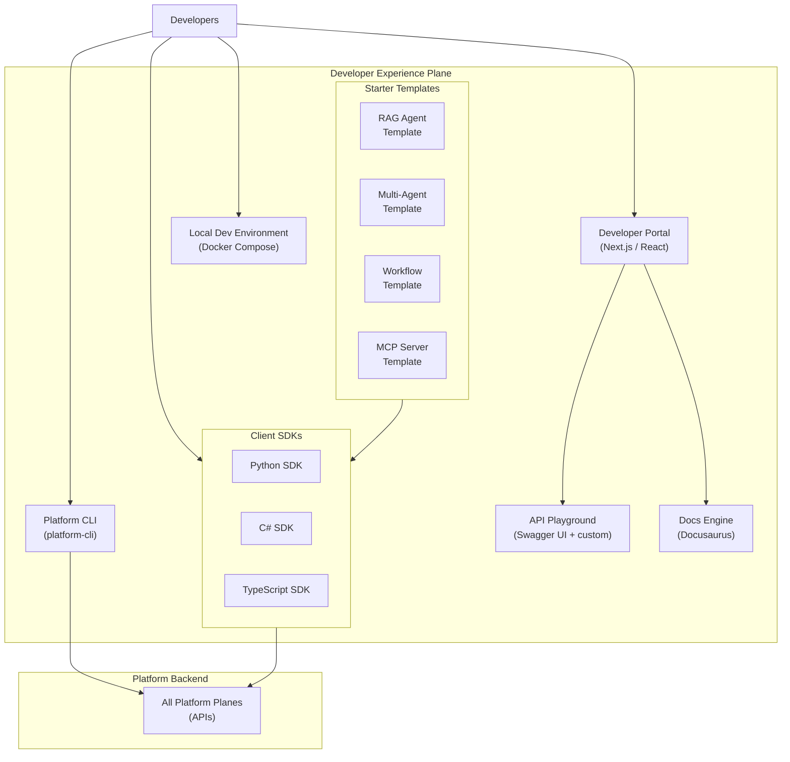

# Plane 15 — Developer Experience

> **Plane:** 15 — Developer Experience
> **Status:** Blueprint
> **Owner:** Platform Developer Relations Team
> **Last Updated:** 2026-05-30

---

## 1. Purpose

The Developer Experience plane provides the tools, SDKs, documentation, templates, and portals that enable platform consumers (AI engineers, application developers, data engineers) to build on the AI Operating Platform effectively and safely without requiring deep platform expertise. It is the platform's "face" to its developers — the primary determinant of whether teams choose the platform or build their own solutions.

---

## 2. Business Problem

A technically excellent platform fails if developers cannot use it. The most common failure modes:
- **Steep learning curve:** Platform concepts are complex; new developers take weeks to become productive
- **Boilerplate tax:** Developers spend more time on plumbing (auth, tracing, tenant context) than on business logic
- **Documentation debt:** Docs are incomplete, outdated, or not tied to real code
- **No local development story:** Developers cannot run the platform locally for fast iteration
- **No templates:** Every team reinvents the same patterns (RAG, agent, workflow)

The Developer Experience plane removes these friction points.

---

## 3. Responsibilities

- Developer portal (discovery, documentation, API reference, playground)
- SDK development (Python SDK, C# SDK, TypeScript SDK)
- CLI tool (platform commands, agent deployment, local dev)
- Starter templates (RAG agent, multi-agent, workflow integration)
- Local development environment (Docker Compose platform stack)
- API playground (interactive API testing in the portal)
- Onboarding flows (step-by-step getting started guides)
- Code examples and tutorials
- Changelog and migration guides
- Developer feedback collection

---

## 4. Architecture Overview



---

## 5. Python SDK

The Python SDK is the primary interface for AI engineers:

```python
from platform_ai import PlatformClient, AgentConfig, RAGPipeline

# Initialize client (auth from env or Vault)
client = PlatformClient(tenant_id="bankA", environment="staging")

# Register and run an agent
agent_config = AgentConfig(
    agent_id="loan-underwriting-agent",
    version="2.3.0",
    model_class="reasoning",
    tools=["knowledge-graph", "vector-search", "human-review"]
)

result = await client.agents.run(
    agent_id="loan-underwriting-agent",
    input={"application_id": "APP-001", "documents": ["doc-uuid-1"]},
    stream=True
)

async for chunk in result:
    print(chunk.content)

# RAG pipeline
rag = RAGPipeline(
    collection="bankA-policies",
    retrieval_k=5,
    rerank=True
)

context = await rag.retrieve("What are the LTV limits for buy-to-let mortgages?")
```

---

## 6. Platform CLI

```bash
# Initialize a new agent project
platform init agent --template rag-agent --name loan-underwriting

# Run platform locally (Docker Compose)
platform dev start

# Deploy an agent
platform deploy agent ./agents/loan-underwriting/ --env staging

# Check agent status
platform agents status --tenant bankA --env production

# Run evaluation
platform eval run --agent loan-underwriting --dataset golden-loan-qa

# View audit log
platform audit query --agent loan-underwriting --since 24h

# Manage prompts
platform prompts push ./prompts/underwriting-system.md --version 2.3.1
```

---

## 7. Local Development Environment

Docker Compose stack that developers run locally:
```yaml
# docker-compose.dev.yml
services:
  platform-api:      # Lightweight C# platform API (subset)
  ai-runtime:        # Python AI runtime
  postgres:          # PostgreSQL
  redis:             # Redis
  qdrant:            # Qdrant (vector store)
  neo4j:             # Neo4j (knowledge graph)
  kafka:             # Kafka (single broker)
  vault-dev:         # Vault (dev mode)
  ollama:            # Local model serving
```

Developers can run this with `platform dev start` and have a full platform environment in 2-3 minutes.

---

## 8. Starter Templates

### RAG Agent Template
```
rag-agent/
├── agent.yaml              # Agent definition
├── prompts/
│   └── system-prompt.md    # System prompt (version-controlled)
├── tools/
│   └── knowledge-search.py # Custom MCP tool
├── evaluation/
│   └── golden-qa.json      # Evaluation dataset
└── pyproject.toml          # Dependencies
```

### Multi-Agent Template
```
multi-agent/
├── supervisor-agent.yaml
├── agents/
│   ├── research-agent.yaml
│   ├── analysis-agent.yaml
│   └── writer-agent.yaml
├── orchestration.py        # Supervisor logic
└── README.md
```

---

## 9. APIs (Developer Portal Backend)

```
GET  /api/v1/portal/catalog           # API catalog (all platform APIs)
GET  /api/v1/portal/docs/{topic}      # Documentation (markdown)
POST /api/v1/portal/playground/invoke # Playground model invocation
GET  /api/v1/portal/templates         # List starter templates
GET  /api/v1/portal/templates/{id}/download # Download template
GET  /api/v1/portal/getting-started   # Onboarding checklist
GET  /api/v1/portal/changelog         # Platform changelog
```

---

## 10. Developer Onboarding Journey

```
Day 1: Platform tour → Dev environment setup → First agent run (30 min)
Day 2: RAG pipeline walkthrough → Knowledge integration → Evaluation run
Day 3: Governance and audit overview → Security model → Production deployment
Week 2: Advanced patterns → Multi-agent → Custom MCP tools
```

---

## 11. Technology Choices

| Category | Primary | Alternative |
|---|---|---|
| Portal | Next.js 14+ / React / TypeScript | Docusaurus only |
| Documentation | Docusaurus | ReadTheDocs |
| Python SDK | httpx async + Pydantic | requests (sync) |
| CLI | Python (Typer) | Go (Cobra) |
| Local dev | Docker Compose | Tilt, Skaffold |
| API docs | OpenAPI + Swagger UI | Redoc |

---

## 12. Future Roadmap

| Priority | Feature | Phase |
|---|---|---|
| High | In-portal agent playground (no code required) | Phase 6 |
| High | One-click agent deployment from portal | Phase 6 |
| Medium | GitHub Copilot extension for platform patterns | Phase 7 |
| Medium | MCP server for Claude Code (platform as MCP tool) | Phase 6 |
| Low | Visual agent graph builder | Phase 8 |
