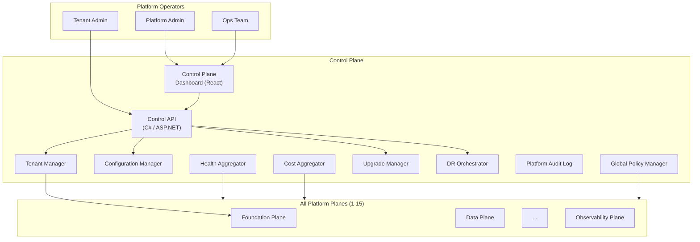
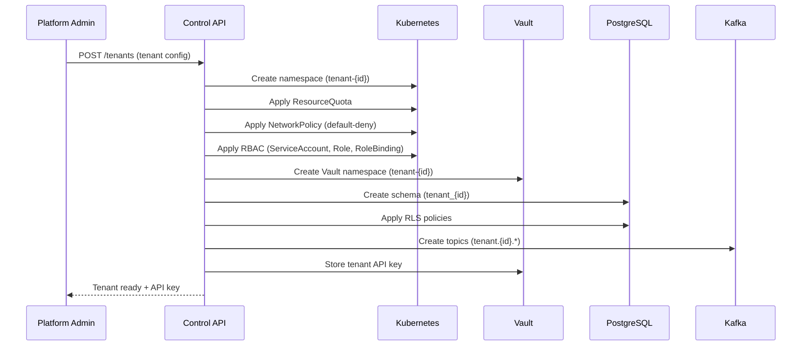

# Plane 16 — Control Plane

> **Plane:** 16 — Control Plane
> **Status:** Blueprint
> **Owner:** Platform Engineering Team
> **Last Updated:** 2026-05-30

---

## 1. Purpose

The Control Plane is the management, configuration, and lifecycle layer for the entire AI Operating Platform. It is the operator's interface to the platform — the system through which platform administrators provision tenants, manage configurations, monitor platform health, enforce platform-wide policies, and manage the platform's own lifecycle (upgrades, scaling, disaster recovery). The Control Plane governs the platform itself, not the AI workloads running on it.

---

## 2. Business Problem

As the platform scales to support many tenants and diverse AI workloads, operational management becomes complex:
- Onboarding a new tenant requires configuring 15+ systems consistently
- Platform upgrades must be zero-downtime and tenant-transparent
- Configuration drift across environments leads to "works in staging, fails in production"
- Platform administrators need a unified view of platform health across all planes
- Cost allocation per tenant requires aggregating data from multiple systems
- Disaster recovery requires coordinated restoration across all planes

The Control Plane is the answer to: "Who manages the platform itself?"

---

## 3. Responsibilities

- Tenant lifecycle management (onboarding, configuration, offboarding)
- Platform configuration management (global + per-tenant settings)
- Platform health monitoring (aggregate view of all planes)
- Capacity planning and resource management
- Platform upgrade management (zero-downtime rollouts)
- Cost aggregation and chargeback (per-tenant cost reports)
- Platform SLA management and reporting
- Disaster recovery orchestration
- Platform audit (who changed what in the platform configuration?)
- Global policy management (platform-wide rules applied to all tenants)
- License and quota management
- Platform API management (API versioning, deprecation notices)

---

## 4. Architecture Overview



---

## 5. Tenant Lifecycle Management

### Onboarding Flow



### Offboarding Flow
1. Mark tenant as "offboarding" (new workloads blocked)
2. Wait for all active workflows and agent runs to complete (or force-stop)
3. Archive tenant audit data to cold storage (regulatory retention)
4. Export tenant data (data portability)
5. Revoke all tenant credentials (Vault)
6. Delete Kubernetes namespace (cascading delete)
7. Delete Vault namespace
8. Drop PostgreSQL schema (after data export confirmed)
9. Delete Kafka topics
10. Record offboarding completion in platform audit

---

## 6. Components

| Component | Technology | Role |
|---|---|---|
| Control API | C# / ASP.NET Core | Operator interface |
| Tenant Manager | C# service | Tenant lifecycle orchestration |
| Config Manager | C# + PostgreSQL | Platform configuration CRUD + history |
| Health Aggregator | C# + Prometheus | Aggregate health from all planes |
| Cost Aggregator | C# + PostgreSQL | Aggregate token/resource costs |
| Upgrade Manager | C# + Argo CD | Manage zero-downtime platform upgrades |
| DR Orchestrator | C# + Velero | Disaster recovery coordination |
| Platform Audit | Kafka + PostgreSQL | Configuration change audit trail |
| Global Policy Manager | C# + OPA | Push global policies to all planes |
| Control Dashboard | React / Next.js | Web UI for platform operators |

---

## 7. APIs

```
# Tenant Management
POST   /api/v1/control/tenants                    # Onboard tenant
GET    /api/v1/control/tenants                    # List tenants
GET    /api/v1/control/tenants/{id}               # Get tenant details
PUT    /api/v1/control/tenants/{id}/config        # Update tenant config
DELETE /api/v1/control/tenants/{id}               # Initiate offboarding
GET    /api/v1/control/tenants/{id}/health        # Tenant health summary
GET    /api/v1/control/tenants/{id}/cost          # Tenant cost report

# Platform Configuration
GET    /api/v1/control/config                     # Platform global config
PUT    /api/v1/control/config/{key}               # Update config value
GET    /api/v1/control/config/history             # Config change history

# Platform Health
GET    /api/v1/control/health                     # Platform health summary
GET    /api/v1/control/health/planes              # Per-plane health
GET    /api/v1/control/health/sla                 # SLA compliance status

# Upgrades
POST   /api/v1/control/upgrades/plan              # Create upgrade plan
GET    /api/v1/control/upgrades/{id}/status       # Upgrade status
POST   /api/v1/control/upgrades/{id}/rollback     # Rollback upgrade

# Cost & Capacity
GET    /api/v1/control/cost/summary               # Platform cost summary
GET    /api/v1/control/capacity/forecast          # Capacity forecast
POST   /api/v1/control/quota/{tenant_id}          # Update tenant quota

# DR
POST   /api/v1/control/dr/backup                  # Trigger backup
POST   /api/v1/control/dr/restore                 # Initiate restore
GET    /api/v1/control/dr/status                  # DR readiness status
```

---

## 8. Platform Health Dashboard

The Control Plane dashboard provides:

**Platform Overview:**
- All 16 planes: GREEN / YELLOW / RED
- Active tenants count
- Active agent runs
- Model invocations per minute
- Platform cost (last 30 days)

**Tenant Overview:**
- Per-tenant resource utilization (% of quota)
- Per-tenant AI spend
- Per-tenant SLA compliance
- Pending HITL requests per tenant

**Operations:**
- Pending upgrades
- Backup status
- Certificate expiry calendar
- Open security alerts

---

## 9. Security Requirements

- Control API requires platform-admin role (not tenant-admin)
- Every control plane operation written to platform audit log
- Tenant offboarding requires two-person authorization (4-eyes principle)
- DR restore requires approval + audit notification
- Global policy changes require staged rollout with validation

---

## 10. Multi-Tenant Considerations

- The Control Plane is itself multi-tenant-aware: tenant admins can access a subset of Control API (their own tenant only)
- Platform admins have cross-tenant visibility
- Cost isolation: each tenant's charges tracked separately for chargeback
- Tenant quotas enforced by Control Plane; overrides require platform-admin approval

---

## 11. Technology Choices

| Category | Primary | Alternative |
|---|---|---|
| Control API | C# / ASP.NET Core | Go |
| Dashboard | React + Next.js | Vue.js, Angular |
| Backup/DR | Velero (K8s) | Kasten K10 |
| Config history | PostgreSQL (event sourced) | Git |
| Upgrade management | Argo CD + Argo Rollouts | Flux + Flagger |

---

## 12. Future Roadmap

| Priority | Feature | Phase |
|---|---|---|
| High | Self-service tenant onboarding portal | Phase 7 |
| High | Automated DR testing (scheduled DR drills) | Phase 7 |
| Medium | Multi-cluster control plane (federated) | Phase 8 |
| Medium | AI-powered capacity planning | Phase 7 |
| Low | Cost optimization recommendations | Phase 8 |
