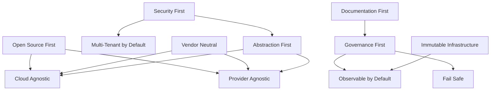

# Architecture Principles — Enterprise AI Operating Platform

> **Document Type:** Platform Principles
> **Status:** Accepted
> **Owner:** Platform Architecture Team
> **Last Updated:** 2026-05-30

---

## Purpose

These principles govern every architectural decision made on the AI Operating Platform. They are not suggestions — they are constraints. When a design violates a principle, the violation must be explicitly documented, justified, and approved as an exception.

---

## Principle Hierarchy

```
┌─────────────────────────────────────────────────────────────┐
│              FOUNDATIONAL PRINCIPLES (Immovable)            │
│         Security First │ Open Source First │ Governance First│
├─────────────────────────────────────────────────────────────┤
│              DESIGN PRINCIPLES (Strong Preferences)         │
│    Cloud Agnostic │ Provider Agnostic │ Abstraction First   │
├─────────────────────────────────────────────────────────────┤
│              OPERATIONAL PRINCIPLES (Standards)             │
│     Documentation First │ Observable │ Multi-Tenant Ready   │
└─────────────────────────────────────────────────────────────┘
```

---

## Foundational Principles

### P1 — Security First

**Statement:** Security is not a feature. It is a baseline. Every component is designed with security as the default state.

**Implications:**
- Zero-trust networking between all services
- All inter-service communication is authenticated and authorized
- Secrets never appear in code, configuration files, or logs
- All data is encrypted at rest and in transit
- Every AI operation produces an audit record
- Principle of least privilege applied to every service identity

**When This Principle Is Violated:**
Security violations are not acceptable. No exception process exists. If a design cannot meet security requirements, the design must change.

---

### P2 — Open Source First

**Statement:** All platform components default to open-source technology. Commercial or proprietary alternatives require documented justification.

**Implications:**
- Technology selection begins with evaluating OSS options
- No proprietary SDK, service, or protocol is used without an abstraction layer
- Commercial support for OSS (e.g., Neo4j Enterprise, Confluent Kafka) is acceptable if the underlying technology is open source
- The platform must be deployable with zero commercial software licenses

**Approved OSS Stack:**
PostgreSQL, Qdrant, Neo4j Community, Apache Kafka, Redis, Kubernetes, Docker, OpenTelemetry, Prometheus, Grafana, Loki, Jaeger, HashiCorp Vault (BSL), LangGraph, FastAPI, ASP.NET Core

**Exception Process:** Documented in ADR with alternatives matrix. Requires Architecture Team approval.

---

### P3 — Governance First

**Statement:** Every AI capability must have governance hooks before it can be deployed. You cannot ship an AI feature without an audit trail.

**Implications:**
- All AI decisions are logged with inputs, outputs, model identity, and timestamp
- All agents have explicit permission scopes
- All data access by AI is logged and attributable to a business context
- Governance events are immutable (append-only audit log)
- Compliance reports are generated from governance data, not application logs

---

## Design Principles

### P4 — Cloud Agnostic

**Statement:** The platform runs identically on AWS, Azure, GCP, and on-premises Kubernetes. No design may depend on a cloud-provider-specific service.

**Implications:**
- Use Kubernetes primitives (not EKS-specific, AKS-specific, or GKE-specific features)
- Use open protocols (S3-compatible storage, not AWS S3 SDK directly)
- Object storage accessed via abstraction (provider adapter pattern)
- No cloud-native AI services (SageMaker, Azure ML, Vertex AI) as platform dependencies
- Cloud-specific services are allowed as **deployment targets** behind adapters

**Test:** Can the platform be deployed to a bare-metal Kubernetes cluster with no cloud dependencies? If not, redesign.

---

### P5 — Provider Agnostic (AI)

**Statement:** The platform must support any AI model provider without code changes. Switching from OpenAI to Claude to Bedrock to Ollama requires only configuration changes.

**Implications:**
- All model calls go through the Model Router in the Model Plane
- No business logic references a specific AI SDK directly
- Provider adapters implement a common interface
- Credentials per provider are managed through Vault
- Model selection is configuration-driven, not code-driven

**Supported Providers (via adapter):**
- Anthropic Claude (claude-opus-4-8, claude-sonnet-4-6, claude-haiku-4-5)
- OpenAI (GPT-4o, o1, o3)
- Azure OpenAI
- AWS Bedrock (Claude, Titan, Llama)
- Google Gemini
- Ollama (local models)
- Any OpenAI-compatible endpoint

---

### P6 — Vendor Neutral

**Statement:** The platform must not create dependency on any single vendor's ecosystem, tooling, or pricing model.

**Implications:**
- No platform API uses a vendor-specific data format that cannot be replaced
- Observability uses OpenTelemetry (vendor-neutral), not a vendor agent
- Agent protocols use MCP (open standard), not a proprietary protocol
- Knowledge graph queries use standard Cypher (not a proprietary query dialect)
- All monitoring exportable to any OTEL-compatible backend

---

### P7 — Abstraction First

**Statement:** Never integrate directly with external systems. Always build an abstraction layer first.

**Implications:**
- External AI providers → Provider Adapter interface
- External storage → Storage Adapter interface
- External identity providers → Auth Adapter interface
- External event buses → Messaging Adapter interface
- This adds a layer of indirection but eliminates structural lock-in

**The Abstraction Rule:** If swapping a dependency would require changing business logic code, the abstraction is insufficient.

---

### P8 — Multi-Tenant by Default

**Statement:** Every component must be designed for multi-tenancy from the start. Retrofitting multi-tenancy is prohibitively expensive.

**Implications:**
- Tenant ID is present in every API request, event, and database record
- Data isolation is enforced at the data layer, not the application layer
- Resource quotas exist for every tenant
- Cross-tenant data access is a security violation, not a bug
- Tenant onboarding and offboarding are automated platform operations

**Tenant Isolation Model:** Namespace-per-tenant in Kubernetes, schema-per-tenant or row-level security in PostgreSQL, index-per-tenant in Qdrant (configurable per deployment tier).

---

## Operational Principles

### P9 — Observable by Default

**Statement:** Every platform component produces traces, metrics, and structured logs using OpenTelemetry. Observability is not optional.

**Implications:**
- Every service instrument with OTEL SDK at initialization
- All AI operations emit spans with model, token counts, latency, and outcome
- Business-level metrics (agent success rate, knowledge retrieval accuracy) are tracked
- Dashboards exist before features are shipped
- Alerts exist for every SLA-relevant metric

---

### P10 — Documentation First

**Statement:** Architecture is documented before implementation begins. Implementation without documentation is rejected.

**Implications:**
- Every new plane, service, or API must have a design document before code is written
- ADRs are created when technology choices are made
- API contracts (OpenAPI specs) are written before implementation
- Runbooks exist for every operational procedure

---

### P11 — Fail Safe

**Statement:** When the platform cannot determine a safe course of action, it chooses inaction over potentially harmful action.

**Implications:**
- Agents default to stopping and requesting human input when uncertain
- Circuit breakers prevent cascading AI failures
- Model fallback chains escalate to human review, not to lower-quality output
- Data pipeline errors are surfaced, not silently swallowed

---

### P12 — Immutable Infrastructure

**Statement:** Platform services do not maintain local state. State belongs to the data plane.

**Implications:**
- All platform services are stateless and horizontally scalable
- Session state lives in Redis, not in service memory
- File system state is not used in production services
- All configuration is externalized (Vault, ConfigMaps)

---

## Principle Interaction Map



---

## Principle Application Guide

When making an architecture decision, work through this checklist:

| Question | Principle |
|---|---|
| Does this design require a specific cloud provider? | P4 — Cloud Agnostic |
| Does this design require a specific AI vendor? | P5 — Provider Agnostic |
| Can I swap this vendor without changing business logic? | P6 — Vendor Neutral |
| Is there an open-source alternative I haven't evaluated? | P2 — OSS First |
| Does every operation produce an audit record? | P3 — Governance First |
| Is tenant data isolated at the data layer? | P8 — Multi-Tenant |
| Can I observe this with OTEL without vendor tooling? | P9 — Observable |
| Is there a design document before I write code? | P10 — Documentation First |
| What happens when this component fails safely? | P11 — Fail Safe |
| Are secrets externalized to Vault? | P1 — Security First |

---

## Exceptions

Exceptions to these principles are rare and require:
1. Written justification (why the principle cannot be met)
2. Risk assessment (what risks the exception introduces)
3. Compensating controls (how we mitigate the risks)
4. Architecture Team approval
5. ADR documenting the exception

Exceptions are reviewed annually and removed when the blocking constraint is resolved.

---

## Related Documents

- [Security Principles](./security-principles.md)
- [Data Principles](./data-principles.md)
- [AI Ethics Principles](./ai-ethics-principles.md)
- [Platform Vision](../vision/platform-vision.md)
