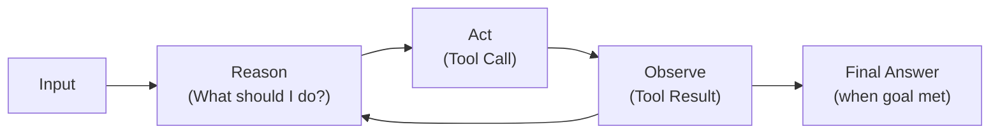
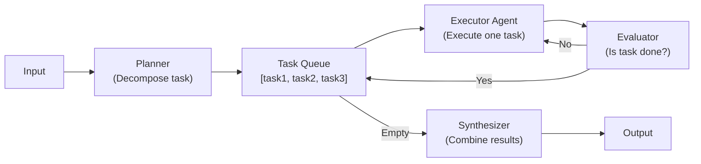
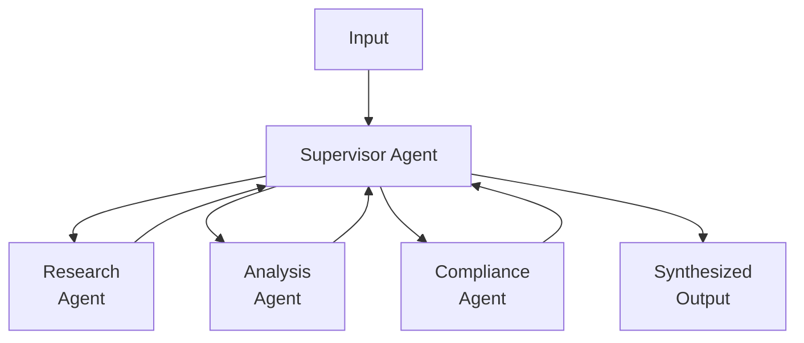
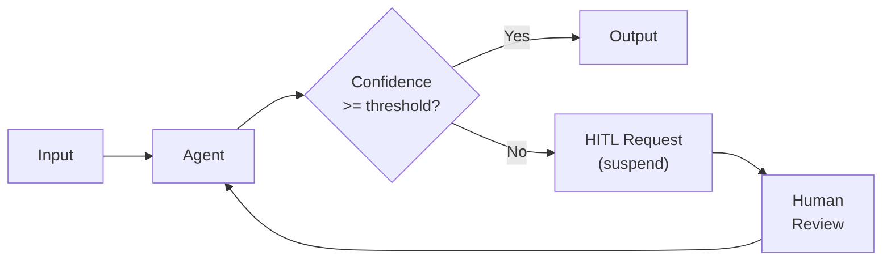

# Reference Architecture — Agentic AI Architecture

> **Document Type:** Reference Architecture
> **Status:** Blueprint
> **Owner:** AI Engineering Team
> **Last Updated:** 2026-05-30

---

## Executive Summary

Agentic AI is the ability to deploy AI systems that autonomously plan, reason, and take actions to achieve goals — without requiring explicit human programming of every step. The platform's Agentic AI architecture provides a governed framework for building agents that are autonomous within declared boundaries, auditable, and safe to operate in regulated environments.

This architecture defines the patterns, components, and constraints that govern all agents deployed on the platform.

---

## Agent Classification

### Reactive Agents
Respond to single-shot inputs. No persistent state between invocations.
**Example:** Document classifier, sentiment analyzer, entity extractor

### Deliberative Agents
Multi-step planning and execution. Maintain state across steps within a single run.
**Example:** Loan underwriting agent, claims analysis agent

### Autonomous Agents
Long-running, event-driven. Persist state across multiple invocations.
**Example:** Portfolio monitoring agent, compliance surveillance agent

### Multi-Agent Systems
Networks of specialized agents coordinated by a supervisor.
**Example:** Research pipeline (researcher + analyst + writer + reviewer agents)

---

## Agent Architecture Patterns

### Pattern 1 — ReAct Agent (Reason + Act)



**Implementation:** LangGraph state machine with Think/Tool/Answer nodes.
**Use case:** Research queries, document analysis with tool use.

---

### Pattern 2 — Plan-and-Execute Agent



**Use case:** Complex multi-step analysis, report generation.

---

### Pattern 3 — Supervisor-Worker Multi-Agent



**Use case:** Complex regulatory review, multi-domain analysis.

---

### Pattern 4 — Human-in-the-Loop Agent



**Use case:** High-stakes financial decisions, medical recommendations.

---

## LangGraph Implementation

All platform agents are implemented as LangGraph state machines:

```python
from typing import TypedDict, Annotated
from langgraph.graph import StateGraph, START, END
from langgraph.checkpoint.kafka import KafkaCheckpointer

# Platform agent state type
class AgentState(TypedDict):
    messages: list
    tenant_id: str
    agent_id: str
    run_id: str
    tool_results: list
    step_count: int
    decision: dict | None
    requires_human_review: bool

# Build graph
graph_builder = StateGraph(AgentState)

# Add nodes
graph_builder.add_node("analyze", analyze_node)
graph_builder.add_node("research", research_node)
graph_builder.add_node("decide", decide_node)
graph_builder.add_node("human_review", human_review_node)

# Add edges with conditional routing
graph_builder.add_edge(START, "analyze")
graph_builder.add_conditional_edges(
    "analyze",
    route_after_analysis,
    {"research": "research", "decide": "decide"}
)
graph_builder.add_conditional_edges(
    "decide",
    route_after_decision,
    {"human_review": "human_review", END: END}
)

# Compile with Kafka checkpointer (platform extension)
checkpointer = KafkaPlatformCheckpointer(
    topic=f"platform.{tenant_id}.agent.checkpoints",
    config=kafka_config
)
graph = graph_builder.compile(checkpointer=checkpointer, interrupt_before=["human_review"])
```

---

## Agent Identity and Security Model

```
Agent Identity:
├── agent_id: platform-scoped unique identifier
├── agent_certificate: X.509 cert (Vault PKI, 24h TTL)
├── tenant_id: immutable tenant binding
├── capability_scope: declared list of capabilities
├── allowed_tools: explicit MCP tool allowlist
├── model_preferences: primary + fallback models
└── governance_profile: risk classification
```

Every agent action is authenticated:
- Agent certificate presented to MCP tool servers
- Tool server verifies certificate + checks tenant claim
- Tool call outcome logged with agent identity

---

## Agent Memory Architecture

```
AGENT MEMORY TYPES:

In-Scope (within a single run):
  Working Memory (Redis)
    └── messages, intermediate_results, tool_outputs
    └── TTL: 24 hours

Cross-Run (persists across invocations):
  Episodic Memory (Qdrant)
    └── past interactions (embedded, searchable)
    └── "Remember this customer inquiry from 3 months ago..."

Semantic Memory (Neo4j + Qdrant):
  Domain Knowledge
    └── Retrieved from knowledge graph at runtime
    └── Updated by the knowledge pipeline continuously

External Memory (Platform Data Sources):
  Authoritative Records
    └── Customer data, transaction history, policies
    └── Always current; never cached in agent memory
```

---

## Governance Model for Agents

Every agent step passes through governance middleware:

```
PRE-STEP:
  1. Is this operation within agent's capability scope?
  2. Does this operation comply with active policies?
  3. Is token budget remaining?
  4. Has time budget expired?

POST-STEP:
  1. Log step outcome to audit (Kafka)
  2. Update trust metrics
  3. Check if human review is required
  4. Update cost tracking
```

---

## Non-Functional Requirements for Agents

| Requirement | Target |
|---|---|
| Agent startup time | < 2 seconds |
| Step execution time (P95) | < 10 seconds |
| Checkpoint write latency | < 100ms |
| HITL request delivery | < 5 seconds |
| Max concurrent agents per tenant | Configurable (default: 50) |
| Agent state persistence | Indefinite (Kafka + cold storage) |
| Audit completeness | 100% (every step logged) |

---

## Anti-Patterns (What NOT to Do)

- **Direct provider SDK calls:** Agents must use Model Plane, not call Anthropic/OpenAI directly
- **Unaudited tool calls:** All tool calls must go through MCP + governance layer
- **Unbounded execution:** Agents must have declared time and token budgets
- **Self-modifying agents:** Agents cannot modify their own capability scope
- **Hardcoded credentials:** Agents use Vault-injected credentials via MCP tool authorization
- **Silent failures:** All errors logged; no silent exception swallowing

---

## Agent Deployment Checklist

Before an agent is approved for production:
- [ ] Agent definition registered in Registry Plane
- [ ] Capability scope declared and reviewed
- [ ] Allowed tools list reviewed by security team
- [ ] Governance profile assigned
- [ ] Evaluation dataset created and evaluation passing
- [ ] Trust score > 0.80
- [ ] HITL gates configured for high-stakes decisions
- [ ] Token and time budgets set
- [ ] Runbook written for operational support
- [ ] Post-deployment monitoring alerting configured
