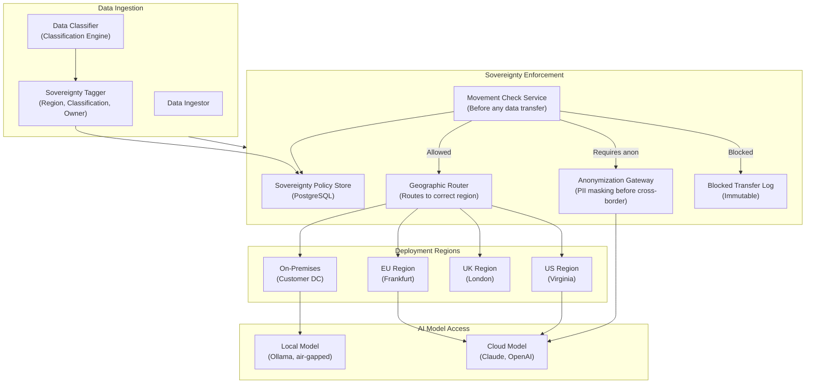

# Reference Architecture — Data Sovereignty Architecture

> **Document Type:** Reference Architecture
> **Status:** Blueprint
> **Owner:** Platform Architecture Team
> **Last Updated:** 2026-05-30

---

## Executive Summary

Data sovereignty in AI systems is the ability to guarantee that data of a given classification, origin, or sensitivity never crosses a boundary (geographic, organizational, legal) without explicit authorization. For regulated enterprises — particularly those subject to GDPR, DPDP (India), PIPL (China), UK GDPR, or US state privacy laws — data sovereignty is a legal requirement, not an architectural preference.

The platform implements data sovereignty through classification-at-ingestion, geographic routing controls, and enforcement at every data movement point.

---

## Data Sovereignty Domains

### Geographic Sovereignty
Data must remain within defined geographic boundaries:
- EU data must remain in EU (GDPR, Schrems II)
- India data must remain in India (DPDP Act)
- China data must remain in China (PIPL, MLPS 2.0)
- Australian data sovereignty for government sector

### Organizational Sovereignty
Data must not leave the organization's direct control:
- No data sent to external model providers without explicit approval
- Air-gapped deployment option for maximum sovereignty

### Regulatory Data Classification
Different data classes have different sovereignty rules:
- **Public:** No restrictions
- **Internal:** Organization boundary only
- **Confidential:** Specific business unit or system
- **Restricted/PHI/PII:** Tightest controls; processing rules apply
- **Secret:** On-premises only; no cloud processing

---

## Sovereignty Architecture



---

## Data Classification Schema

Every data object in the platform carries sovereignty metadata:

```json
{
  "data_id": "doc-uuid-001",
  "classification": "restricted",
  "data_type": "PII",
  "origin_region": "EU",
  "origin_country": "DE",
  "owner_tenant": "tenant-bankA",
  "retention_until": "2031-05-30",
  "transfer_restrictions": {
    "allow_regions": ["EU"],
    "require_anonymization_for": ["US", "UK"],
    "always_blocked_for": ["CN", "RU"]
  },
  "subject_erasure_eligible": true,
  "regulatory_basis": ["GDPR", "BaFin"]
}
```

---

## Sovereignty Enforcement Points

### Point 1 — Data Ingestion
Classification applied at ingestion. Data tagged with origin, classification, and transfer restrictions. Data that cannot be classified is quarantined until classification is confirmed.

### Point 2 — AI Model Routing (Critical)
Before any data is sent to an AI model provider:

```python
async def route_model_request(request: ModelRequest, tenant_config: TenantConfig):
    # Get data classification for all data in context
    classifications = await classify_context_data(request.messages)
    
    # Check if data can be sent to requested provider
    for classification in classifications:
        check = await sovereignty_service.check_transfer(
            data_classification=classification,
            source_region=tenant_config.data_region,
            destination=request.provider_region  # e.g., "us-east-1"
        )
        
        if check.blocked:
            raise SovereigntyViolationError(f"Cannot send {classification} data to {request.provider}")
        
        if check.requires_anonymization:
            request = await anonymizer.anonymize(request, classification)
    
    return await model_router.invoke(request)
```

**For maximum sovereignty (Restricted/Secret data):**
```
Restricted data → ONLY routed to on-premises Ollama
Never sent to external AI providers
```

### Point 3 — Knowledge Plane Queries
Graph traversal results tagged with source classification. Results containing restricted data not returned to callers without the appropriate clearance.

### Point 4 — Audit and Lineage
All sovereignty checks (allowed/blocked/anonymized) recorded in the governance audit log. Required for GDPR Article 30 records of processing activities.

---

## Deployment Topology Options

### Option 1 — Cloud-Hosted (with sovereignty controls)

```
Cloud Provider (e.g., Azure EU North)
├── AKS Cluster (EU region)
│   ├── All tenant data stored in EU
│   └── AI model calls: EU-hosted provider endpoints (Azure OpenAI EU)
```

### Option 2 — Hybrid (cloud + on-premises)

```
Cloud (AI compute for non-restricted)
├── AKS Cluster
└── AI Model Providers (via restricted rules)

On-Premises (restricted data)
├── Kubernetes (RKE2)
├── Ollama (local model inference for restricted data)
└── All restricted data stores
```

### Option 3 — Air-Gapped (maximum sovereignty)

```
On-Premises Only
├── Kubernetes (RKE2)
├── All platform services (no cloud dependencies)
├── Ollama + local models (no external AI providers)
├── All data stores (no cloud storage)
└── No external network access required
```

---

## Erasure (Right to Be Forgotten)

GDPR Article 17 requires data subjects can request deletion. For AI systems:

```
Erasure request → Erasure Orchestrator:
  1. Delete from PostgreSQL (all tables with subject_id)
  2. Delete from Qdrant (filter by subject_id metadata)
  3. Delete from Neo4j (MATCH {subject_id: ...} DELETE)
  4. Delete from Kafka (subject-based encryption key deletion)
  5. Archive raw documents to quarantine (for legal hold check)
  6. Invalidate embedding cache (re-embed affected documents)
  7. Record erasure completion in governance audit
  8. Return erasure certificate (with timestamp and scope)
```

**Note:** Embeddings derived from personal data may require index rebuild if subject's data was a significant contributor. This is tracked via the lineage service.

---

## Compliance Mapping

| Regulation | Sovereignty Requirement | Platform Control |
|---|---|---|
| GDPR | EU data stays in EU | Geographic routing + movement check |
| GDPR Art. 17 | Right to erasure | Erasure orchestrator |
| GDPR Art. 20 | Data portability | Tenant data export via Control Plane |
| DPDP (India) | India data localization | IN region routing |
| PIPL (China) | China data localization + cross-border assessment | CN region + manual approval gate |
| HIPAA | PHI processing controls | Data classification: PHI type |
| UK GDPR | UK data requirements post-Brexit | UK region routing |
