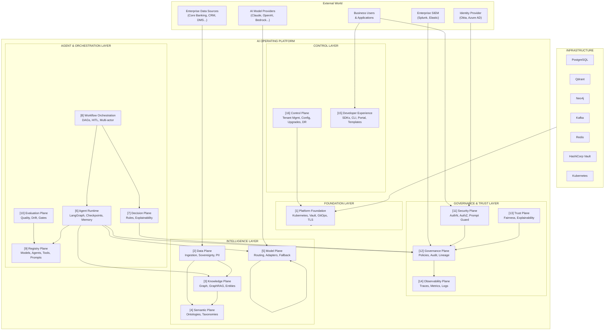

# Reference Architecture — Enterprise AI Operating Platform

> **Document Type:** Reference Architecture (Master)
> **Status:** Blueprint
> **Owner:** Platform Architecture Team
> **Last Updated:** 2026-05-30

---

## Executive Summary

The Enterprise AI Operating Platform is a horizontally scalable, governance-first, multi-tenant AI control plane. This document provides the master architecture view — the "one diagram" that shows how all 16 planes relate to each other and to external systems. It is the entry point for all platform architecture work.

---

## Platform Architecture (Master View)

---

## Architecture Layers

### Foundation Layer (Layer 1)
The infrastructure substrate. Kubernetes orchestration, HashiCorp Vault for secrets, cert-manager for PKI, Argo CD for GitOps deployment, and network policy enforcement. All other layers depend on this.

### Intelligence Layer (Layers 2-5)
Data ingestion and sovereignty, knowledge graph management, semantic/ontology management, and the model abstraction layer. This is where raw data becomes queryable knowledge and where AI models are called through a governed abstraction.

### Agent & Orchestration Layer (Layers 6-10)
AI agent execution, decision management, workflow orchestration, artifact registry, and continuous evaluation. This is where AI does work — agents run, decisions are made, workflows execute, and quality is measured.

### Governance & Trust Layer (Layers 11-14)
Security enforcement, governance policy evaluation, trust and fairness management, and observability. This layer runs cross-cutting concerns that apply to all other layers.

### Control Layer (Layers 15-16)
The operator interface (Control Plane) and the developer interface (Developer Experience). This is how the platform is managed and how teams build on it.

---

## Key Integration Points

| Integration | Direction | Protocol | Description |
|---|---|---|---|
| Enterprise IdP | Inbound | OIDC/OAuth 2.0 | User authentication |
| AI Model Providers | Outbound | HTTPS/REST | Model invocations via Model Plane |
| Enterprise Data Sources | Inbound | JDBC/REST/CDC | Data ingestion via Data Plane |
| Enterprise SIEM | Outbound | Kafka/Syslog | Security event streaming |
| Business Applications | Inbound | REST/gRPC | Platform API consumption |
| MCP Tool Servers | Both | MCP (HTTP/stdio) | Agent tool integration |

---

## Cross-Cutting Concerns

### Tenant Context Propagation
Every operation carries `tenant_id`. This flows from the entry point (API gateway) through every service call, database query, Kafka event, and audit record. No operation is tenant-ambiguous.

### OpenTelemetry Instrumentation
Every service in every layer is instrumented with OpenTelemetry. A single user request generates a distributed trace that spans the API gateway, platform services, AI runtime, model provider call, and database queries — with all AI-specific attributes (tokens, model, agent step) included.

### Kafka as the Audit Backbone
Every plane publishes governance and audit events to Kafka. The Governance Plane consumes these events and writes them to the immutable audit store. This decouples the audit concern from every individual service.

### Policy-as-Code (OPA)
Authorization and governance policies are Rego code. They are versioned in Git, tested in CI, and deployed to OPA instances running as sidecars. Policy changes have the same lifecycle discipline as application code.

---

## Technology Reference

| Layer | Primary Technologies |
|---|---|
| Container runtime | Docker, Kubernetes (RKE2 on-prem, managed cloud) |
| Platform services | C# 12 / .NET 8 / ASP.NET Core |
| AI runtime | Python 3.12 / FastAPI / LangGraph |
| Frontend / Portal | React 18 / Next.js 14 / TypeScript |
| Event streaming | Apache Kafka (KRaft) |
| Primary database | PostgreSQL 16 |
| Cache | Redis 7 |
| Vector store | Qdrant |
| Knowledge graph | Neo4j 5 / Kuzu |
| Secrets | HashiCorp Vault |
| Telemetry | OpenTelemetry / Prometheus / Grafana / Loki / Jaeger |
| Agent protocol | Model Context Protocol (MCP) |
| Authorization | Open Policy Agent (OPA) |
| Identity | OIDC + mTLS + Vault PKI |
| GitOps | Argo CD |

---

## Related Documents

- [Platform Vision](../vision/platform-vision.md)
- [Architecture Principles](../platform-principles/architecture-principles.md)
- [ADR Index](../adrs/)
- [Planes Index](../planes/)
- [Roadmap Overview](../roadmaps/roadmap-overview.md)
