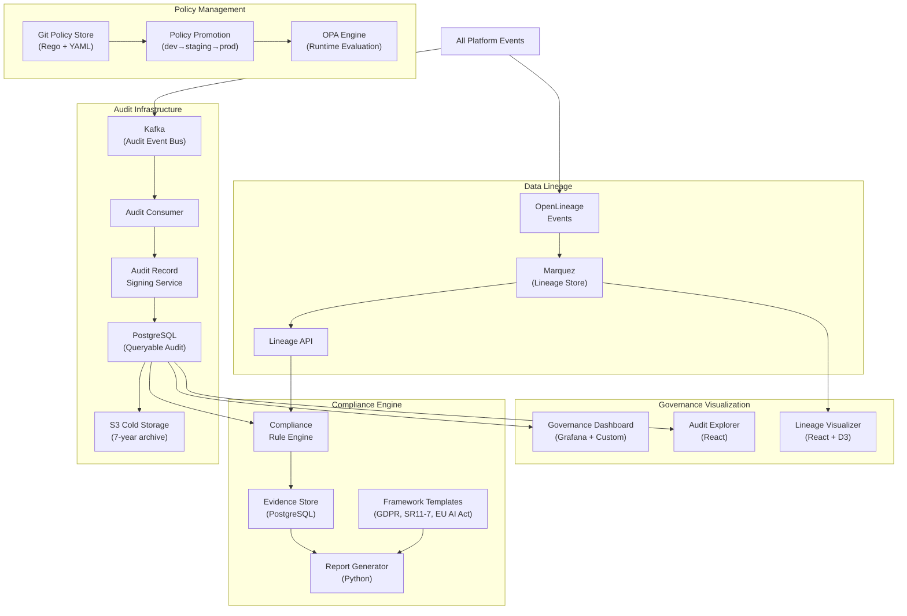

# Reference Architecture — Governance Architecture

> **Document Type:** Reference Architecture
> **Status:** Blueprint
> **Owner:** AI Governance Team
> **Last Updated:** 2026-05-30

---

## Executive Summary

AI governance in regulated enterprises is not optional documentation — it is a continuous, automated, and evidenced process. The platform's governance architecture treats governance as infrastructure: policies are code, audit records are immutable, and compliance evidence is generated automatically. This architecture enables organizations to deploy AI at scale while maintaining the governance posture required by financial, healthcare, and government regulators.

---

## Governance Framework Overview

```
GOVERNANCE DOMAINS:
┌─────────────────────────────────────────────────────────────────┐
│ OPERATIONAL GOVERNANCE    │ RISK GOVERNANCE                     │
│ - Policy enforcement      │ - Model risk management (SR 11-7)   │
│ - Resource management     │ - Bias and fairness monitoring       │
│ - SLA compliance          │ - Explainability requirements        │
├─────────────────────────────────────────────────────────────────┤
│ DATA GOVERNANCE           │ REGULATORY COMPLIANCE               │
│ - Data lineage            │ - GDPR Art. 22 (automated decisions)│
│ - Data sovereignty        │ - EU AI Act (high-risk AI)          │
│ - Data classification     │ - HIPAA (PHI access)                │
│ - Retention policies      │ - SOX (financial reporting AI)      │
└─────────────────────────────────────────────────────────────────┘
```

---

## Governance Architecture



---

## Policy-as-Code Framework

All governance policies are written in Rego (OPA) and managed in Git:

```
policies/
├── global/
│   ├── rate-limits.rego
│   ├── model-access.rego
│   └── data-classification.rego
├── compliance/
│   ├── gdpr/
│   │   ├── automated-decision-disclosure.rego
│   │   └── data-minimization.rego
│   ├── eu-ai-act/
│   │   ├── high-risk-ai-oversight.rego
│   │   └── transparency-requirements.rego
│   └── sr-11-7/
│       ├── model-validation-gates.rego
│       └── model-inventory.rego
├── tenant-templates/
│   ├── banking-default.rego
│   ├── insurance-default.rego
│   └── healthcare-default.rego
└── tenant-overrides/
    ├── tenant-bankA/
    └── tenant-bankB/
```

### Example Policy (GDPR Automated Decision)

```rego
package platform.compliance.gdpr

# GDPR Article 22: Automated decisions require disclosure
# High-stakes decisions must have human oversight or explicit consent

violation[msg] {
    input.decision.stakes == "high"
    input.decision.fully_automated == true
    not input.decision.human_review_completed
    not input.consumer.explicit_consent_given
    
    msg := sprintf(
        "GDPR Art.22 violation: High-stakes automated decision %v requires human review or explicit consent",
        [input.decision.id]
    )
}
```

---

## Audit Log Architecture

### Immutability Guarantees

1. **Kafka:** Once written, events cannot be modified (Kafka's append-only log)
2. **PostgreSQL:** Audit table has no UPDATE or DELETE permissions for any role
3. **Cryptographic signing:** Each record signed with Vault-managed key
4. **Hash chaining:** Each record includes hash of previous record (blockchain-like integrity)
5. **Cold storage:** Monthly batches archived to S3 with S3 Object Lock (WORM)

### Audit Schema Design

```sql
CREATE TABLE audit_events (
    id              UUID DEFAULT gen_random_uuid(),
    sequence_number BIGINT NOT NULL,  -- monotonically increasing
    timestamp       TIMESTAMPTZ NOT NULL,
    event_type      TEXT NOT NULL,
    tenant_id       TEXT NOT NULL,
    actor_type      TEXT NOT NULL,  -- 'human', 'service', 'agent'
    actor_id        TEXT NOT NULL,
    resource_type   TEXT NOT NULL,
    resource_id     TEXT,
    operation       TEXT NOT NULL,
    outcome         TEXT NOT NULL,  -- 'success', 'denied', 'error'
    metadata        JSONB NOT NULL,
    input_hash      TEXT,           -- SHA-256 of input (not input itself)
    output_hash     TEXT,           -- SHA-256 of output
    previous_hash   TEXT NOT NULL,  -- hash chain for integrity
    record_hash     TEXT NOT NULL,  -- this record's hash (signed)
    signature       TEXT NOT NULL   -- HMAC signature (Vault Transit)
) PARTITION BY RANGE (timestamp);

-- No UPDATE permission granted to any role
-- No DELETE permission granted to any role  
-- Append-only enforced at database level
```

---

## SR 11-7 Model Risk Governance

The Federal Reserve's SR 11-7 guidance requires:

| Requirement | Platform Implementation |
|---|---|
| Model inventory | Registry Plane: all models registered with purpose, owner, usage |
| Model validation before deployment | Quality Gate in Evaluation Plane |
| Model documentation | ADR-style model cards in Registry Plane |
| Ongoing model monitoring | Continuous evaluation in Evaluation Plane |
| Challenge process | Challenger model evaluation in Evaluation Plane |
| Change management | Model version promotion workflow in Registry Plane |
| Periodic review | Quarterly evaluation reports from Evaluation Plane |

---

## EU AI Act Alignment

For High-Risk AI Systems (Annex III):

| Article | Requirement | Implementation |
|---|---|---|
| Art. 9 | Risk management system | Trust Plane: risk score, oversight config |
| Art. 10 | Data governance | Data Plane: lineage, quality, bias check |
| Art. 11 | Technical documentation | Registry Plane: model cards, agent specs |
| Art. 13 | Transparency | Trust Plane: transparency reports |
| Art. 14 | Human oversight | Agent Runtime + Workflow: HITL gates |
| Art. 15 | Accuracy and robustness | Evaluation Plane: continuous eval |
| Art. 16 | Obligations of providers | Governance Plane: audit trail |
| Art. 17 | Quality management | Evaluation + Governance planes |

---

## Governance Reporting

### Available Reports

1. **Model Risk Report (SR 11-7):** Inventory, validation status, monitoring results
2. **GDPR Processing Record (Art. 30):** Data processing activities involving AI
3. **EU AI Act Conformity Assessment Support:** Technical documentation package
4. **HIPAA AI Access Audit:** PHI accessed by AI systems (by system, by period)
5. **SOX IT Controls Evidence:** AI decision audit trail for financial processes
6. **Fairness Report:** Bias metrics across protected groups per AI system

---

## Non-Functional Requirements

| Requirement | Target |
|---|---|
| Audit record durability | 99.999999% (7 nines) |
| Audit record retention | 7 years minimum |
| Policy evaluation latency | < 10ms (OPA sidecar) |
| Audit write latency | < 100ms (async via Kafka) |
| Compliance report generation | < 5 minutes |
| Lineage query latency | < 2 seconds |
