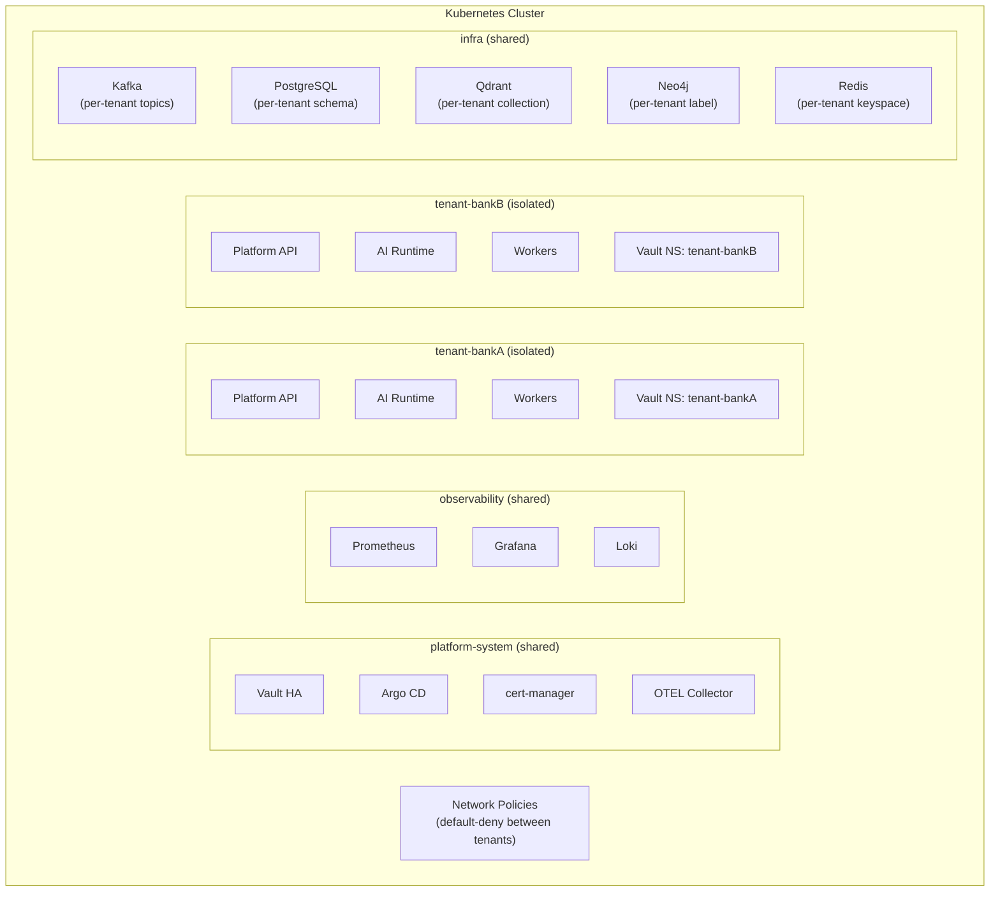

# Reference Architecture — Multi-Tenant Architecture

> **Document Type:** Reference Architecture
> **Status:** Blueprint
> **Owner:** Platform Architecture Team
> **Last Updated:** 2026-05-30

---

## Executive Summary

The AI Operating Platform supports multiple tenants on shared infrastructure while maintaining strict data isolation, resource fairness, and independent configuration. The multi-tenant model is designed for regulated industries where tenant data isolation is a compliance requirement, not a preference. This architecture ensures that a breach, failure, or misconfiguration in one tenant's context cannot affect other tenants.

---

## Tenancy Model

The platform supports three tenancy tiers:

| Tier | Description | Use Case |
|---|---|---|
| **Shared** | Shared compute, separate data namespaces | SaaS, cost-optimized deployments |
| **Isolated** | Dedicated compute namespace, shared cluster | Regulated financial/healthcare tenants |
| **Sovereign** | Dedicated cluster, dedicated infrastructure | Government, maximum data sovereignty |

---

## Architecture: Namespace-Per-Tenant Model



---

## Isolation Model Per Data Store

### PostgreSQL

```sql
-- Per-tenant schema approach
CREATE SCHEMA tenant_bankA;
CREATE SCHEMA tenant_bankB;

-- Row-level security (alternative to per-schema)
CREATE POLICY tenant_isolation ON audit_events
  USING (tenant_id = current_setting('app.tenant_id'));

-- Application sets tenant context on each connection
SET app.tenant_id = 'tenant_bankA';
```

### Qdrant (Vector Store)

```
Collection isolation strategy:
  tenant_bankA_documents    (documents collection)
  tenant_bankA_agent_memory (agent memory collection)
  tenant_bankB_documents
  tenant_bankB_agent_memory

Access controlled by: platform service uses per-tenant API key
```

### Apache Kafka

```
Topic naming convention: platform.{tenant_id}.{domain}.{event_type}
  platform.tenant-bankA.agent.events
  platform.tenant-bankA.governance.audit
  platform.tenant-bankB.agent.events

ACL: each tenant's service account only has access to its own topics
```

### Redis

```
Key namespace: {tenant_id}:{service}:{resource}:{id}
  tenant-bankA:agent:working_memory:run-001
  tenant-bankB:agent:working_memory:run-002

Redis does not support ACL per prefix natively at fine granularity;
platform services enforce tenant_id filtering in application code.
```

### Neo4j

```cypher
// All nodes labeled with tenant_id
CREATE (n:Entity {tenant_id: "tenant-bankA", ...})

// All queries include tenant filter
MATCH (n {tenant_id: $tenant_id}) RETURN n
LIMIT 100

// Platform service injects tenant_id from JWT; cannot be overridden by caller
```

---

## Network Isolation

```yaml
# Default-deny: no traffic between tenant namespaces
apiVersion: networking.k8s.io/v1
kind: NetworkPolicy
metadata:
  name: default-deny-all
  namespace: tenant-bankA
spec:
  podSelector: {}
  policyTypes: [Ingress, Egress]
  ingress: []   # No ingress by default
  egress: []    # No egress by default

---
# Explicit allow: tenant services can call platform-system services
apiVersion: networking.k8s.io/v1
kind: NetworkPolicy
metadata:
  name: allow-platform-system
  namespace: tenant-bankA
spec:
  podSelector: {}
  egress:
    - to:
        - namespaceSelector:
            matchLabels:
              kubernetes.io/metadata.name: platform-system
      ports:
        - protocol: TCP
          port: 8200  # Vault
```

---

## Resource Isolation

```yaml
# ResourceQuota per tenant namespace
apiVersion: v1
kind: ResourceQuota
metadata:
  name: tenant-quota
  namespace: tenant-bankA
spec:
  hard:
    requests.cpu: "8"
    requests.memory: "16Gi"
    limits.cpu: "16"
    limits.memory: "32Gi"
    pods: "50"
    services: "20"
    persistentvolumeclaims: "10"
```

Quota tiers:
| Tier | CPU | Memory | Pods | AI Invocations/day |
|---|---|---|---|---|
| Starter | 4 cores | 8GB | 20 | 10,000 |
| Standard | 16 cores | 32GB | 100 | 100,000 |
| Enterprise | 64 cores | 128GB | 500 | Unlimited |
| Sovereign | Dedicated cluster | Dedicated | Unlimited | Unlimited |

---

## Secret Isolation

```
Vault Namespaces (enterprise feature) or separate Vault paths:

/v1/tenant-bankA/secret/...
/v1/tenant-bankB/secret/...
/v1/platform/secret/...

Each tenant's service account can only authenticate to its own Vault path.
Platform services can access all paths (for cross-tenant operations like cost aggregation).
```

---

## Observability Multi-Tenancy

```
Prometheus: all metrics labeled with tenant_id
Loki: log streams labeled with {tenant_id, service, namespace}
Jaeger: all traces tagged with tenant_id
Grafana: folder-based RBAC (Tenant A admin → Folder "Bank A" only)
```

---

## Tenant Identity Token Model

Every API request carries a JWT with tenant claims:

```json
{
  "sub": "service-account:ai-runtime",
  "tenant_id": "tenant-bankA",
  "tenant_tier": "standard",
  "roles": ["ai-service"],
  "permissions": ["agents:invoke", "knowledge:read"],
  "iat": 1717027200,
  "exp": 1717027800
}
```

Platform services extract `tenant_id` from JWT. All data operations are scoped to this tenant_id. A service cannot claim a different tenant_id than its certificate.

---

## Cross-Tenant Scenarios

| Scenario | Policy |
|---|---|
| Tenant A agent reads Tenant B data | Blocked at API and data layer |
| Platform admin audits Tenant A | Allowed (logged and audited) |
| Shared knowledge base (opt-in) | Supported via explicit federation grant |
| Tenant data export | Supported via Control Plane API (tenant-admin) |
| Cross-tenant workflow | Not supported in v1; Phase 7 roadmap |

---

## Onboarding Sequence

See [Control Plane](../planes/16-control-plane.md) Section 5 for the full tenant onboarding sequence diagram.

---

## Non-Functional Requirements

| Requirement | Target |
|---|---|
| Tenant onboarding time | < 15 minutes (automated) |
| Cross-tenant data leak probability | Zero (enforced at multiple layers) |
| Performance isolation | One tenant's workload cannot degrade another's |
| Tenant offboarding (data deletion) | < 24 hours after instruction |
| Max tenants per cluster (Standard tier) | 50 |
