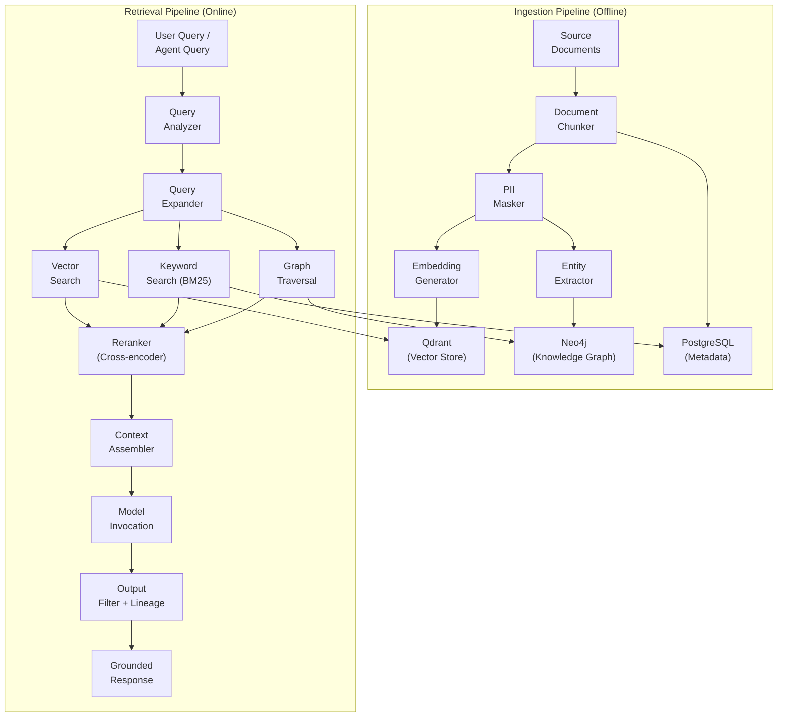
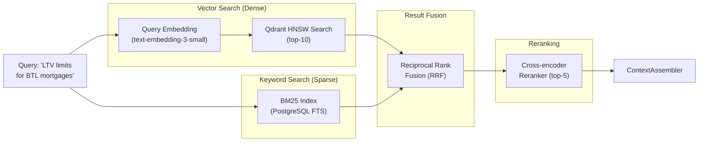

# Reference Architecture — RAG (Retrieval-Augmented Generation)

> **Document Type:** Reference Architecture
> **Status:** Blueprint
> **Owner:** AI Engineering Team
> **Last Updated:** 2026-05-30

---

## Executive Summary

Retrieval-Augmented Generation (RAG) is the platform's primary mechanism for grounding AI model outputs in enterprise-specific knowledge. Rather than relying solely on a model's trained knowledge, RAG retrieves relevant documents, facts, and knowledge graph nodes at query time and provides them as context to the model. This dramatically improves accuracy, reduces hallucination, and ensures AI answers are based on current, authoritative organizational knowledge.

The platform implements a **multi-stage, governed RAG pipeline** that includes document ingestion, intelligent chunking, hybrid search (vector + keyword), re-ranking, context assembly, and governed model invocation — with full lineage tracking from query to answer.

---

## Architecture Goals

1. Ground AI responses in authoritative organizational knowledge
2. Reduce hallucination rate to < 5% for knowledge-dependent queries
3. Support sub-500ms retrieval for real-time queries
4. Enable hybrid search (semantic + structured metadata filtering)
5. Maintain full lineage from source document to AI response
6. Support GraphRAG (knowledge graph traversal + vector search)
7. Enable multi-tenant knowledge isolation

---

## RAG Pipeline Architecture



---

## RAG Variants

### 1 — Basic Vector RAG
For general document search. Retrieves top-K chunks by cosine similarity.

**Use case:** Policy Q&A, general knowledge retrieval

### 2 — Hybrid RAG (Vector + BM25)
Combines dense vector search with sparse BM25 keyword search. Best for queries with specific terminology.

**Use case:** Regulatory clause search, technical documentation

### 3 — GraphRAG (Knowledge Graph + Vector)
Combines vector search with graph traversal. For structured knowledge with relationships.

**Use case:** "What regulations apply to this product in this jurisdiction?"

### 4 — Multi-Vector RAG
Stores multiple embeddings per document (summary, full text, key phrases). Retrieves from the most appropriate index.

**Use case:** Long-form document analysis

### 5 — Agentic RAG
An AI agent iteratively decides which queries to run, evaluates results, and runs follow-up queries.

**Use case:** Complex research tasks, multi-hop reasoning

---

## Hybrid Search Architecture



---

## Context Assembly

```
CONTEXT WINDOW ASSEMBLY:
┌────────────────────────────────────────────────────────┐
│ SYSTEM PROMPT (tenant + domain instructions)           │
│ RETRIEVED CONTEXT:                                     │
│   [1] Chunk from: Mortgage Policy v3.2 (score: 0.94)  │
│   [2] Chunk from: BTL Guidelines 2024 (score: 0.91)   │
│   [3] Graph: Product→Regulation→Requirement           │
│   [4] Chunk from: FCA Handbook MCOB 11 (score: 0.88)  │
│ USER QUERY:                                            │
│   "What are the LTV limits for buy-to-let?"            │
└────────────────────────────────────────────────────────┘
```

---

## Evaluation Metrics (RAGAS)

| Metric | Formula | Target |
|---|---|---|
| Context Recall | (Relevant chunks retrieved / All relevant chunks) | > 0.85 |
| Context Precision | (Relevant in retrieved / All retrieved) | > 0.80 |
| Faithfulness | (Claims grounded in context / All claims) | > 0.90 |
| Answer Relevance | Semantic sim(answer, question) | > 0.85 |

---

## Security Model

- Documents PII-masked before embedding (PII never in vector store)
- Vector collections tenant-isolated (no cross-tenant retrieval)
- All retrieval operations logged with querier identity
- Retrieved document sources included in lineage record
- Access to specific document collections governed by RBAC

---

## Performance Targets

| Operation | Target |
|---|---|
| Document ingestion | 100 docs/minute |
| Embedding generation | < 500ms per document |
| Vector search (top-10) | < 50ms |
| Hybrid search | < 150ms |
| Reranking (top-10 → top-5) | < 200ms |
| End-to-end RAG query | < 3 seconds (P95) |

---

## Chunking Strategy

```
Document Type → Chunking Strategy:
├── PDFs with text: Recursive character split (512 tokens, 50 overlap)
├── PDFs with tables: Table-aware splitter + markdown table extraction
├── Word/HTML docs: Semantic chunking (sentence-boundary aware)
├── Code: Language-aware splitter (function/class boundaries)
├── Emails: Paragraph-level chunking
└── Structured data (CSV/JSON): Record-level chunking
```

---

## Dependencies

| Dependency | Role |
|---|---|
| Data Plane | Document ingestion, PII masking |
| Model Plane | Embedding generation, model invocation |
| Knowledge Plane | Graph traversal (GraphRAG) |
| Qdrant | Vector storage and search |
| Evaluation Plane | RAG quality measurement |
| Governance Plane | Lineage and audit |
